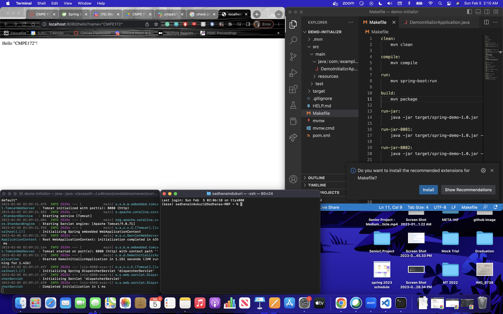
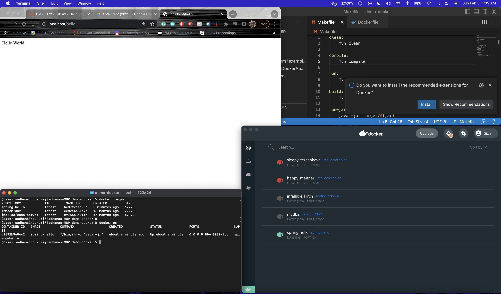
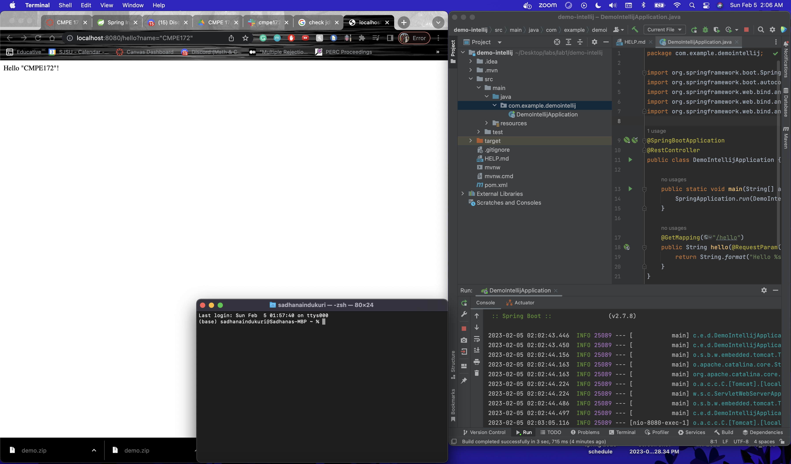

# CMPE 172 - Lab #1 Notes

## Spring Demo App Using Spring Initializr
After running the the spring demo app on my local machine in port 8080, here is the result:

## Spring Demo App Configured for Docker
After building my docker image and running the docker image container in docker desktop locally, here is the result: 

## Spring Demo App  Using JetBrains Intellij IDEA
After running the Spring Demo App on my local machine, here is the result: 

