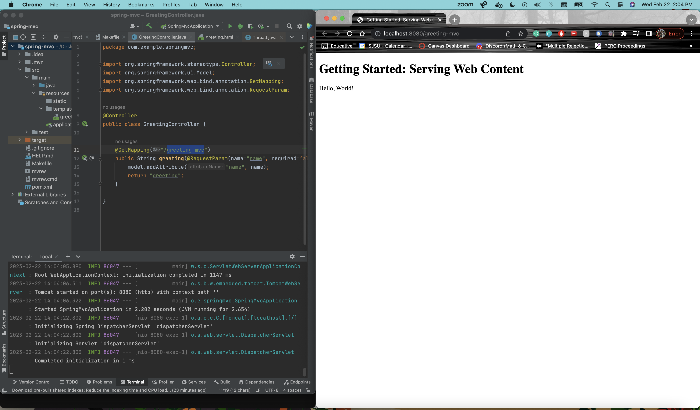
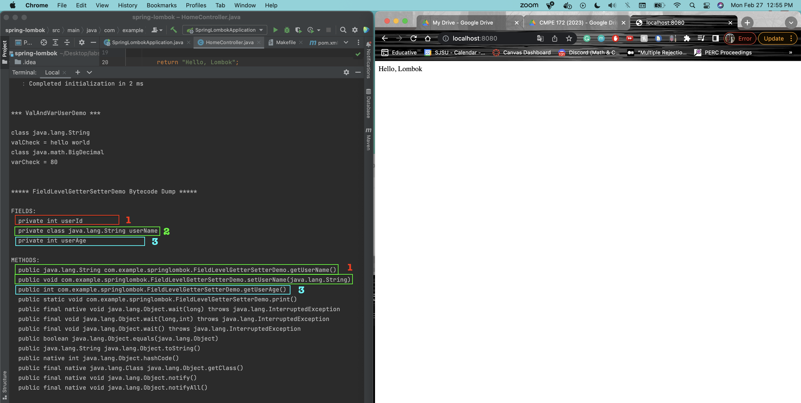
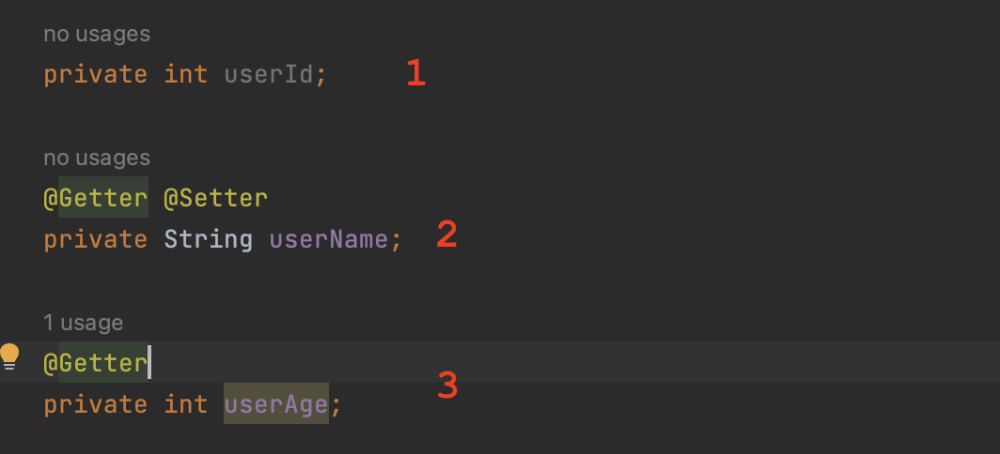
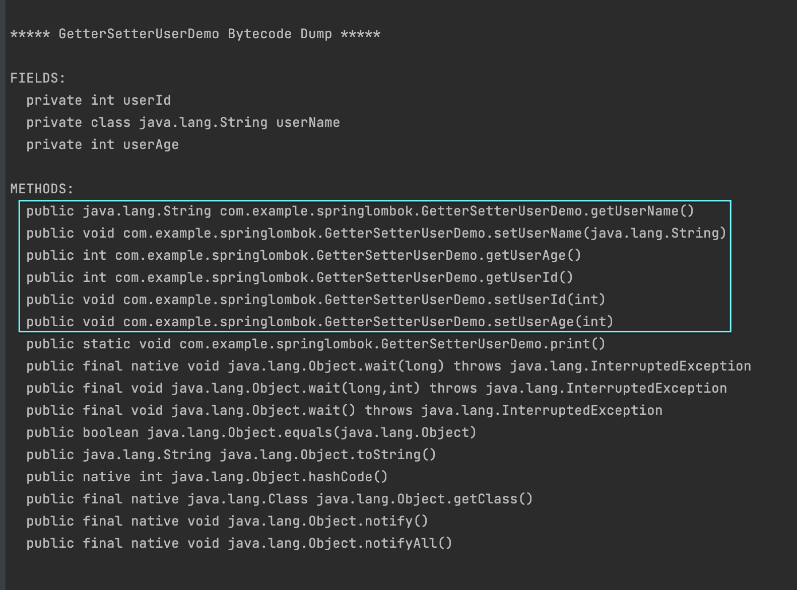
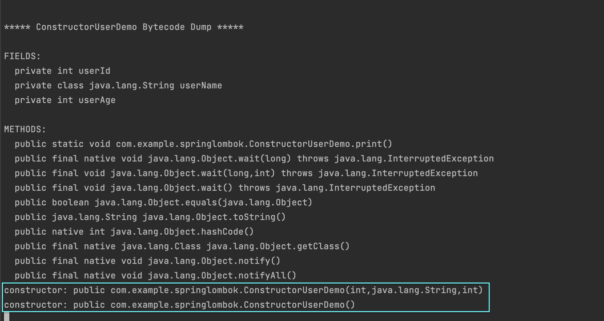
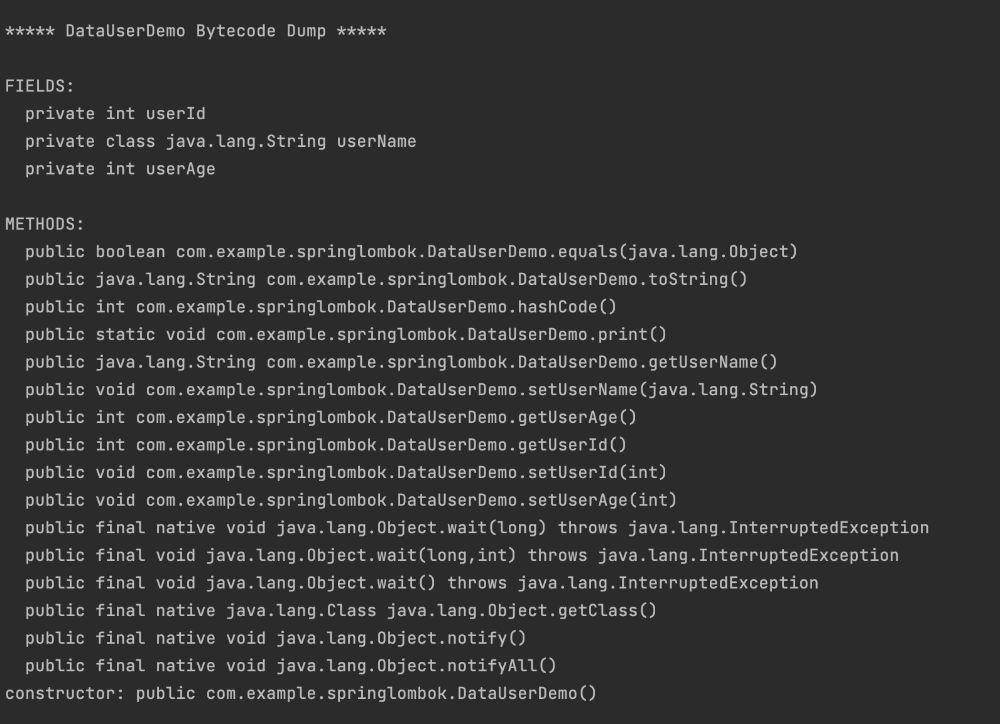
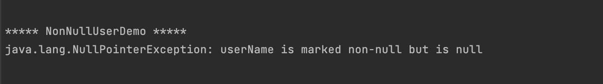

# CMPE 172 - Lab #2 Notes

## Spring MVC Project- Serving Web Content with Spring MVC
After running the the spring MVC project on my local machine in port 8080, here is the result:

## Spring Lombok

### ValAndVarUser and FieldLevelGetterSetter DEMO:

There is no @setter and @getter annotations for userid, so there are no setter and getter methods in the list. There is @setter and @getter annotations for username, so there are setter and getter methods in the list. There is a @getter annotations and no @setter for userage, so there is only a getter methods in the list.

The val variable has "hello world" while var has 80.

### GetterSetterUserDemo:

There should be setters and getters for all of the field variables, which there are. 

### ConstructorUserDemo:

I added code to show that there are constructors created by the @AllArgsConstructor and @NoArgsConstructor. At the bottom, there is a list of the costructors created.

### DataUserDemo:

@Data is like having @Getter, @Setter, @ToString, @EqualsAndHashCode and @RequiredArgsConstructor annotations on the class. Here is proof that those exist.

### NonNullUserDemo

The username has a nonnull annotation so if null is being passed to this field variables, the output is similar to the image above

