# CMPE 172 - Lab #3 Notes
## Screenshots of Deployment Via Docker
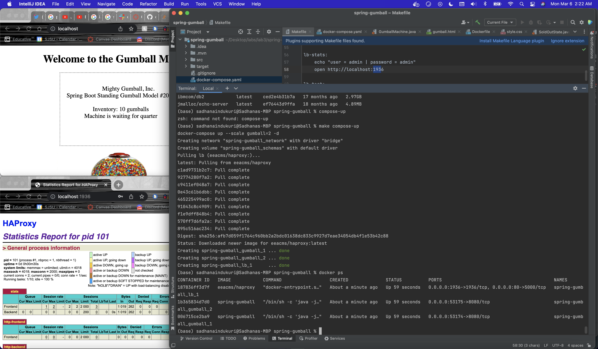
The two docker containers are present. 

## When you load the page multiple times what do you see on the Gumball Home Pages for Server Host/IP?
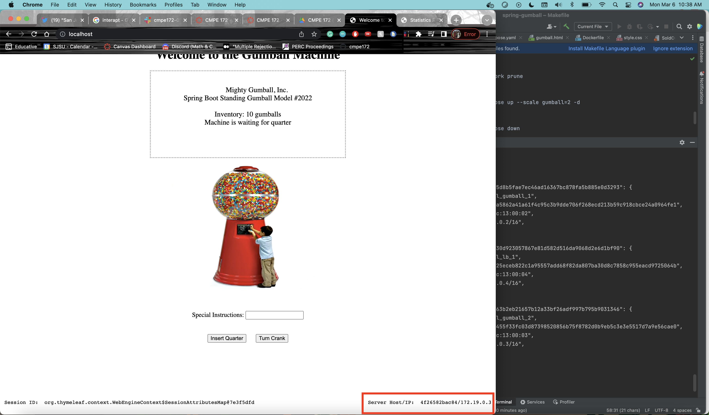
Every time we refresh, the IP address changes from .2 to .3. It is performing round-robin and going in between the two IP addresses of the containers shown above.

## Can you explain where that IP value comes from?
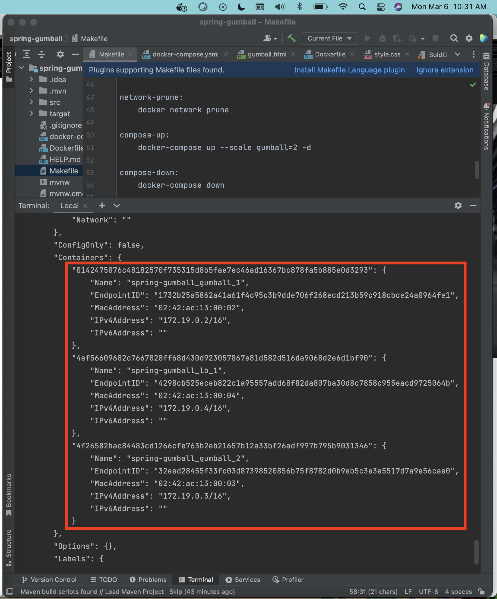
There are two pods created with the following IP addresses: 172-19-0-2 and 172-19-0-3. Currently it is on 172-19-0-2. IP addresses that are associated with our docker containers. There are three containers. Load balancer is is on .4. Other two containers are on .3 and .2. Since I did my lab in the span of two days, when I reset my enviroment, the IP addresses changed. However, they always end in .2, .3, and .4

## Now, try to add some quarters and purchase some gumballs. Do you see the inventory depleting?  Are there any errors?
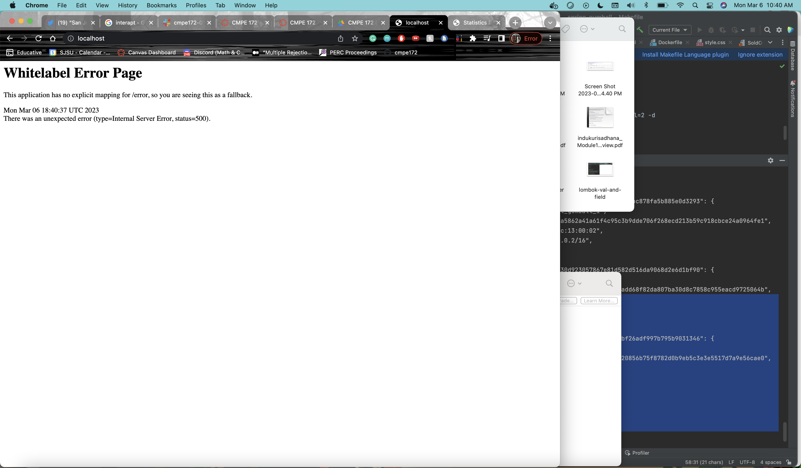
When we press insert quarter, we are getting a white label error page. The inventory is not depleting.

## Review to code for your answer. 
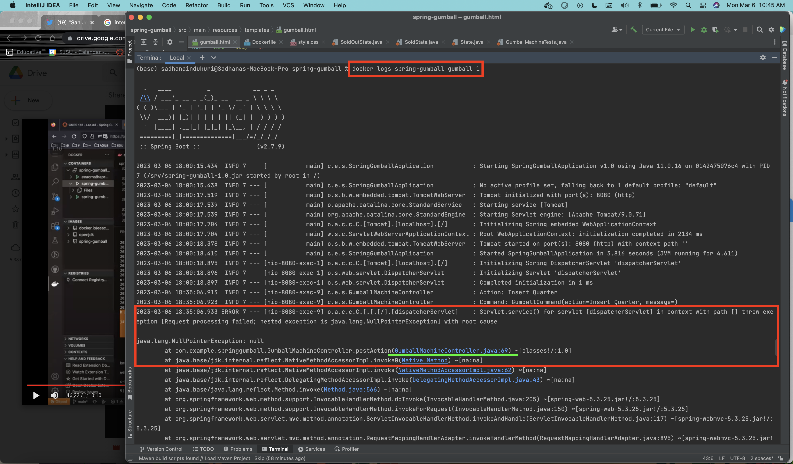
 This error is happening on the server. We have to go look at the server logs. This will be in docker! The logs state that there is a null exception on line 69 of GumballMachineController
 
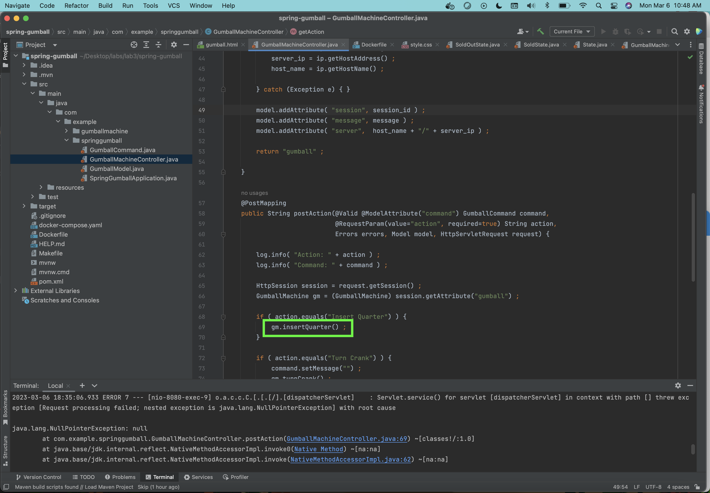
gm.insertQuarter() is the line that is causing the issue. This means that gm is null, however it should be pointing at the session object in session table for user. However, it found null. When first started, our app will create session in server one memory based on gumball creation and associates it with the cookie in browser through JSESSIONID. But, then next request is moved to machine two, when we ask it to insert quarter. But there is no gumball instantiated or have any session in server two RAM. Therefore, we get an issue.

## Is there a setting that can avoid the error?  Why does it work (or Why not).
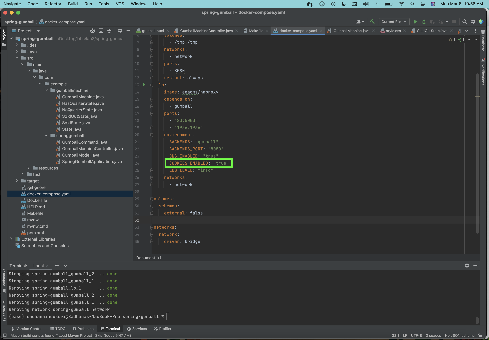
To fix this issue, we need the second request, insert quarter, to go back to the same original server. This can be achieved through sticky session. All we would need to do is change COOKIES_ENABLED: “false” to COOKIES_ENABLED: "true" in docker-compose.yaml.

It's working!!

## Ping endpoints and load balancer 
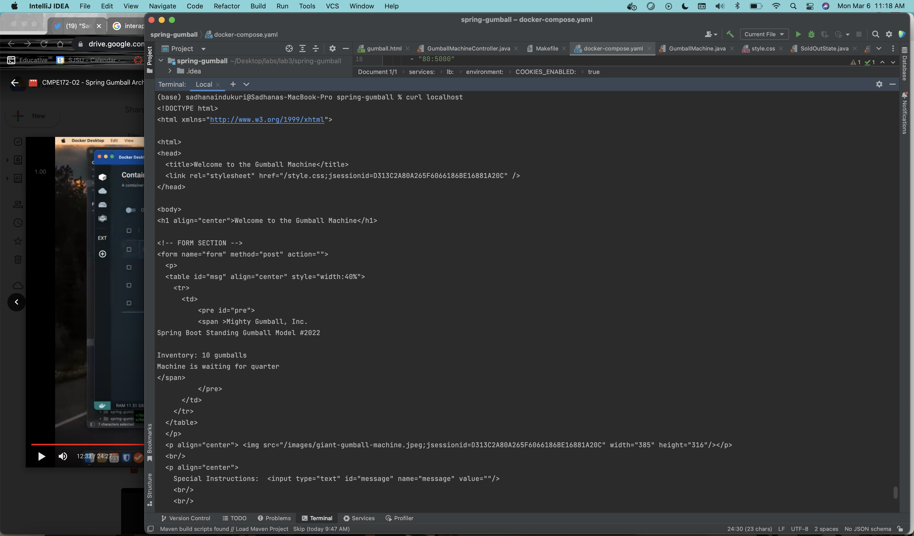
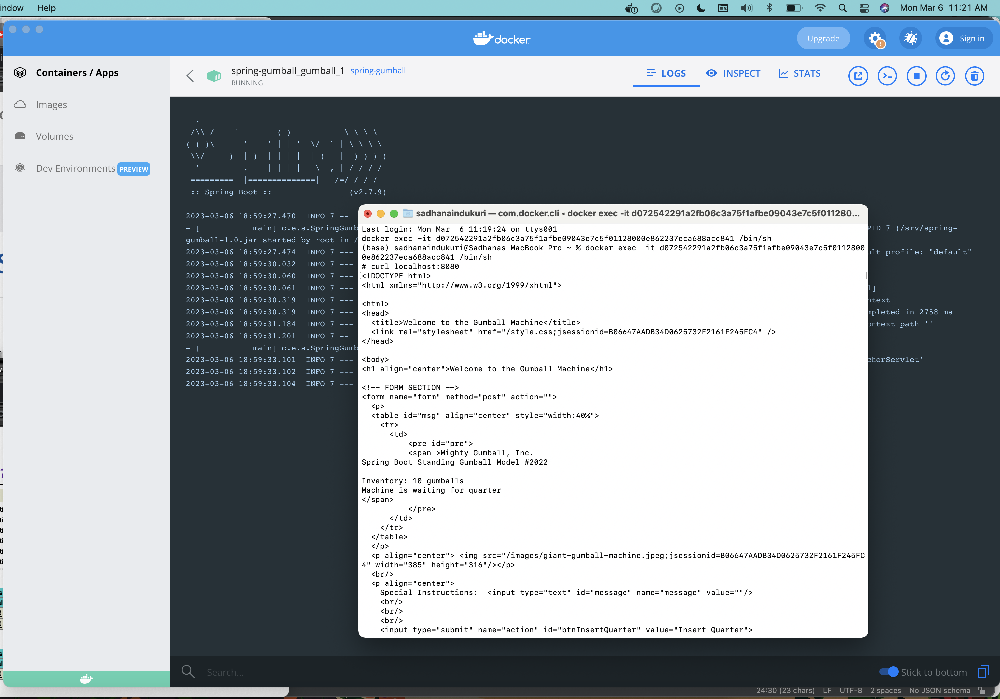
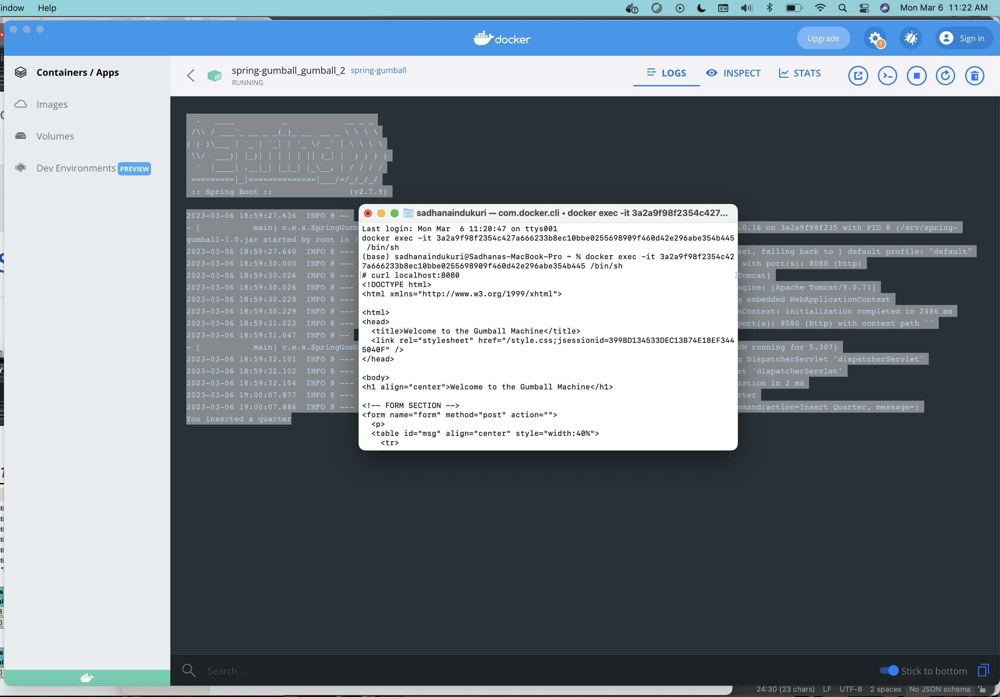
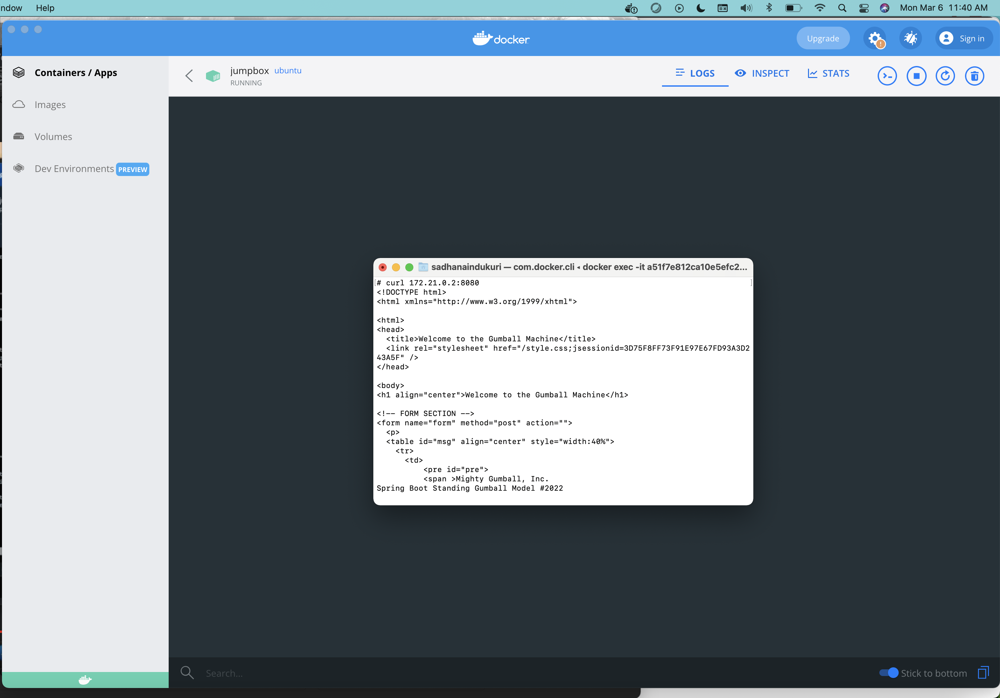

