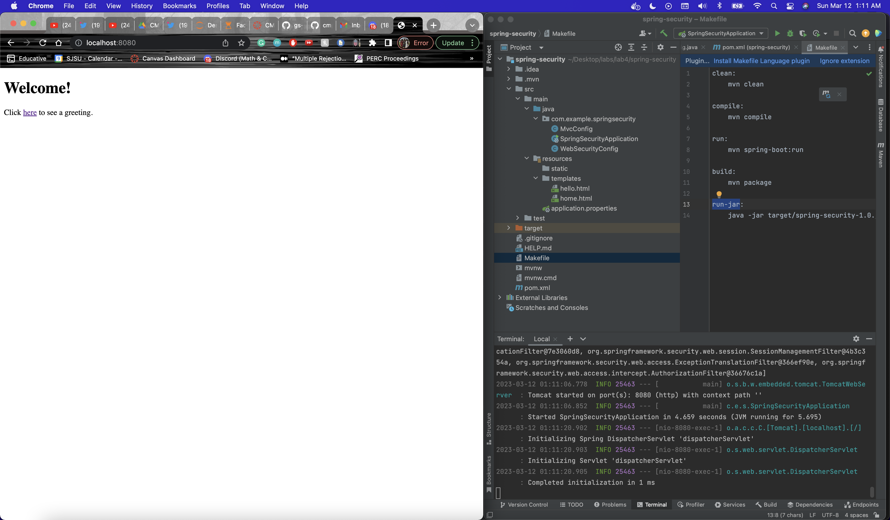
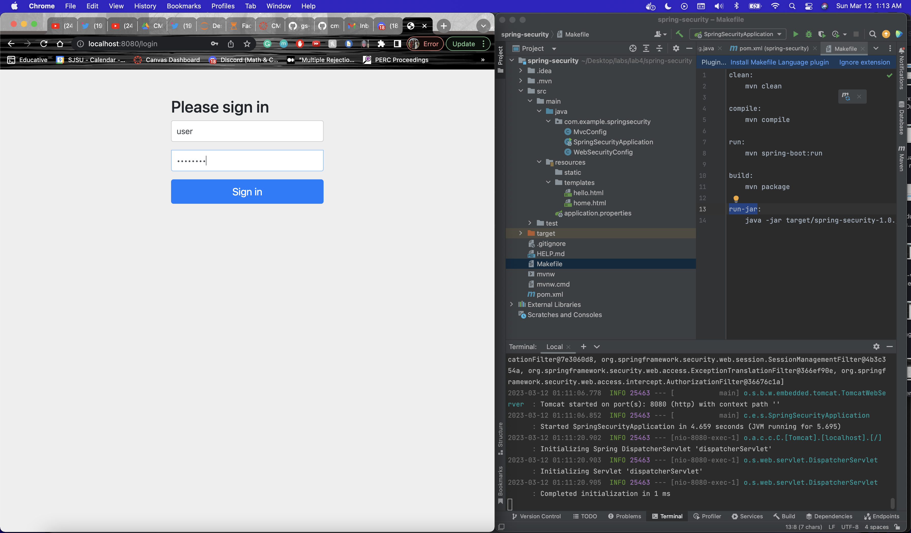
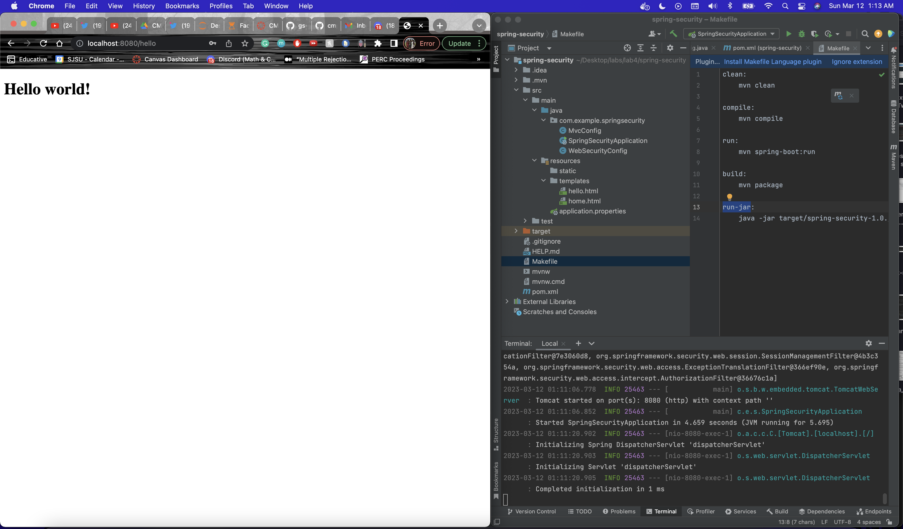
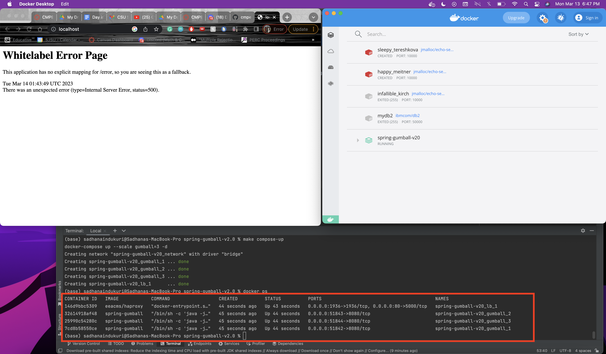
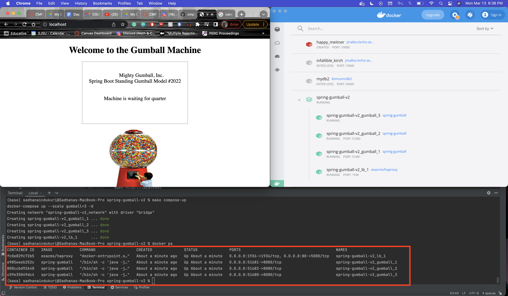
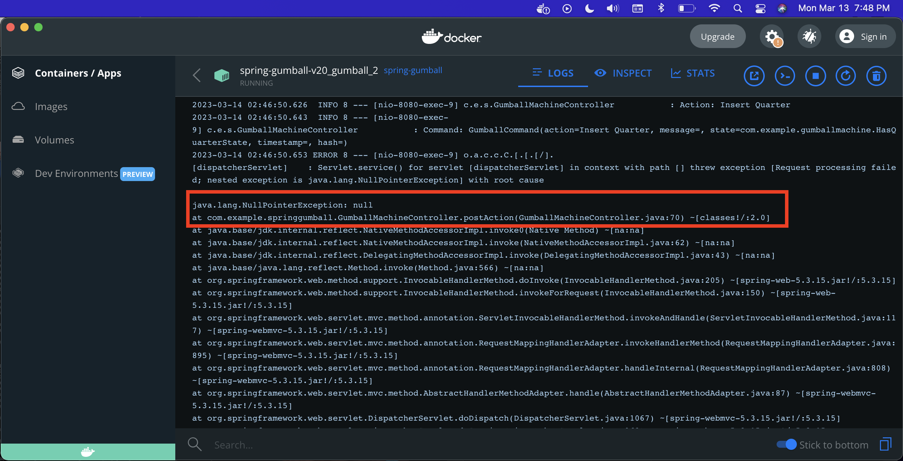
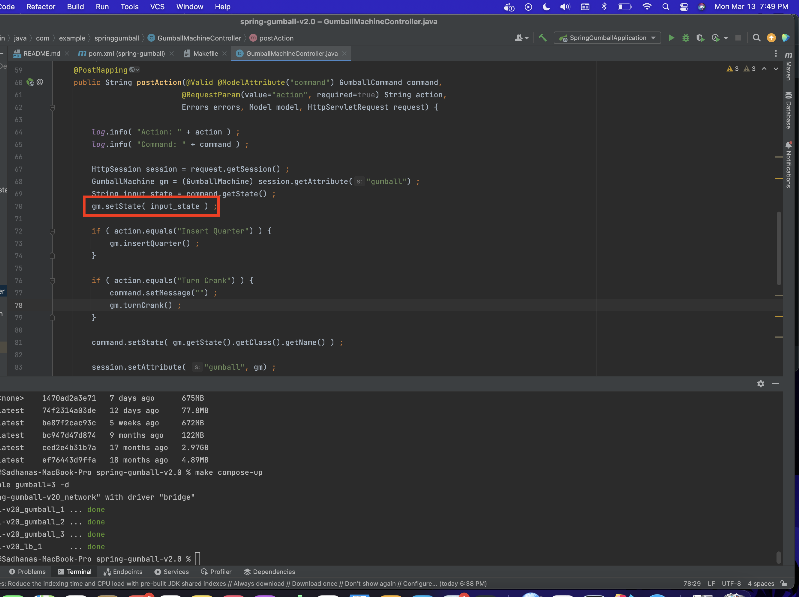
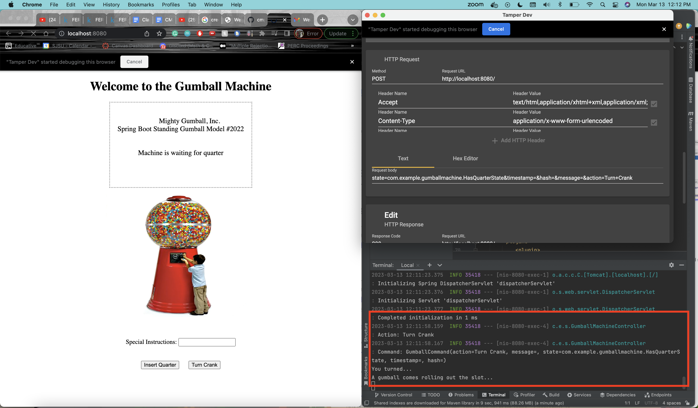
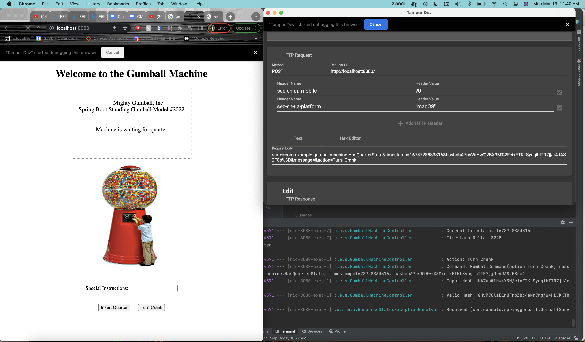

# CMPE 172 - Lab #4 Notes

## Naming Conventions
Version 1 is lab 3 code, utilizes session logic  
Version 2.0 is starter code for lab 4, utilizes session logic  
Version 2.1 is the solution to lab 4, removes session logic  

## Screenshots and Discussion confirming a working Spring Security project

Through the implementation of spring security, we were able to ask a user to enter their credentials in order to get access to a certain part of our project. To do this, we heavily relied on the WebSecurityConfig.java file. This file had two beans that helped implement security for our project. This file determined which URL paths must be secured behind the asking of credentials and they determined what user credentials can be used to sign in. Thanks largely in part to this file, our project required a login to get access to the hello world page, proving that our implementation of the spring security project works. 

## Screenshots of your deployment of Spring Gumball 
### V1.0 (V2.0 starter code will have the same error so I used that!)

### V2.1

## Do you see any errors that were observed in Spring Gumball (Version 1)? Why or Why Not?  Explain the technical details to support your observation.

Previously, in version 1 and version 2.0, we relied on sessions logic. This caused an error here: 

The line causing the error is gm.getState(input_state). This means that gm is null, however it should be pointing at the session object in session table for user. However, it found null. When first started, our app will create session in server one memory based on gumball creation and associates it with the cookie in browser through JSESSIONID. But, then next request is moved to machine two, when we ask it to insert quarter. But there is no gumball instantiated or have any session in server two RAM. Therefore, we get an issue. Previously, in lab 3, we solved this issue through the use of sticky sessions. However, in lab 4, we want to remove our use of sessions in their entirety. So, we had the broweser keep track of the state that the gumball is currently in and reconstruct the gumball everytime it is necessary. This way we do not need to keep track of the gumball being used by a particular user but rather can just reconstruct a gumball based on the state that is needed. 

## Using the initial version of Spring Gumball v2.0, demonstrate a Replay Attack

## Using your modified version of Spring Gumball v2.0, demonstrate how a Replay Attack is thwarted

There are security issues in the initial version of V2 (2.0) because the POST method can easily be intercepted and manipulated without anyone knowing. For example, a person can get a gumball without having inserted a quarter. This security fallacy through sessions logic is why Version 2.1 utilizes HMAC. Through hashing, we can ensure that a third party can’t intercept and change the body of a POST method because the original body is contained in the hash that is also in the body of the POST method. When a hash that was in the payload does not match the hash that was initially sent, our controller handles that discrepancy. Because the hash requires a timestamp and the state, if one were to change the state, now the hash won’t match. That is the key difference in the implementation of version 2,0 and 2.1 of the gumball machine.
