# CMPE 172 - Lab #5 Notes

## spring-rest-level2 Screenshots
### Get Employees
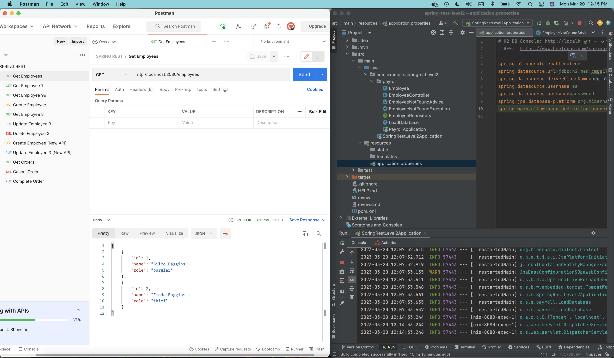
### Get Employee 1
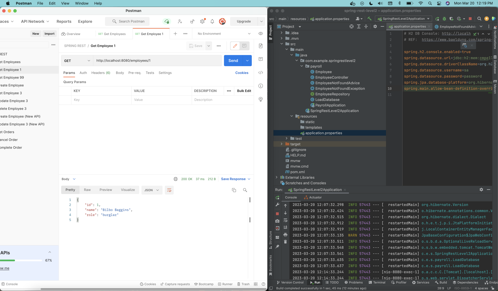
### Get Employee 99

### Create Employee
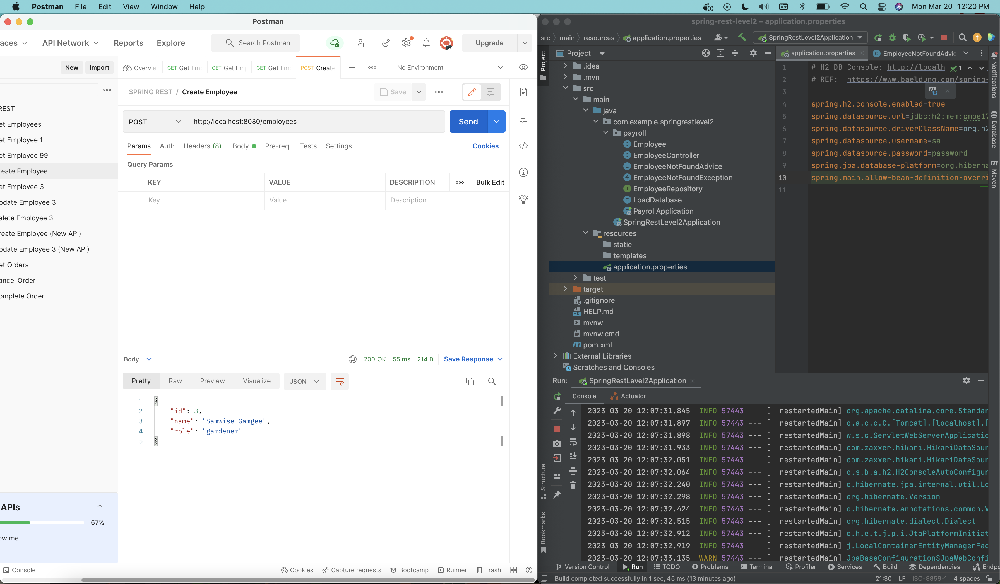
### Get Employee 3

### Update Employee 3

### Delete Employee 3

### Create Employee New API
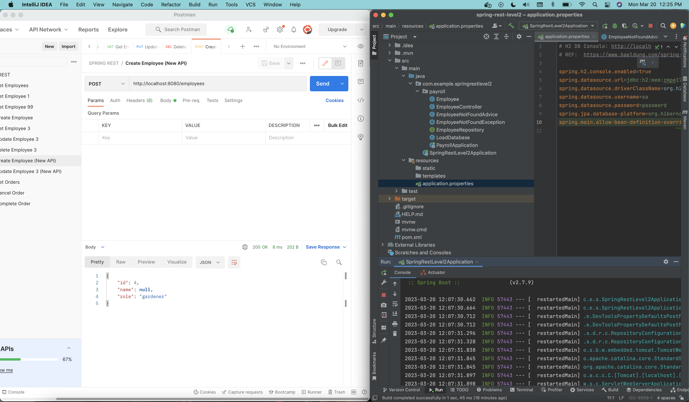
### Update Employee New API
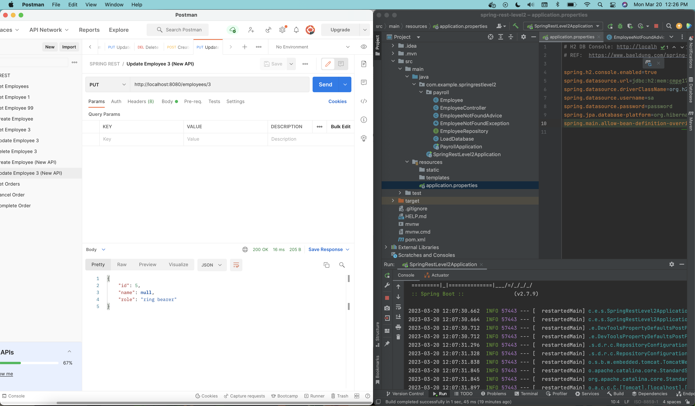
### We were told not to add the orders implementation, but here are the API calls via Postman, just in case:

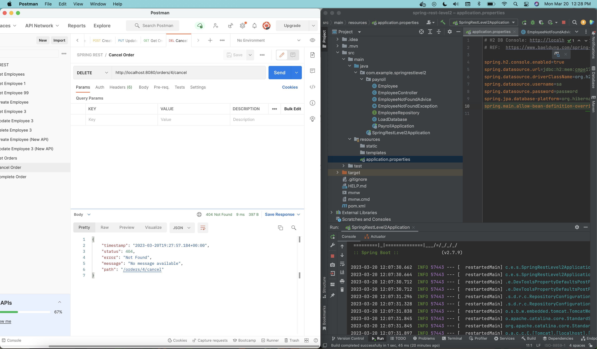
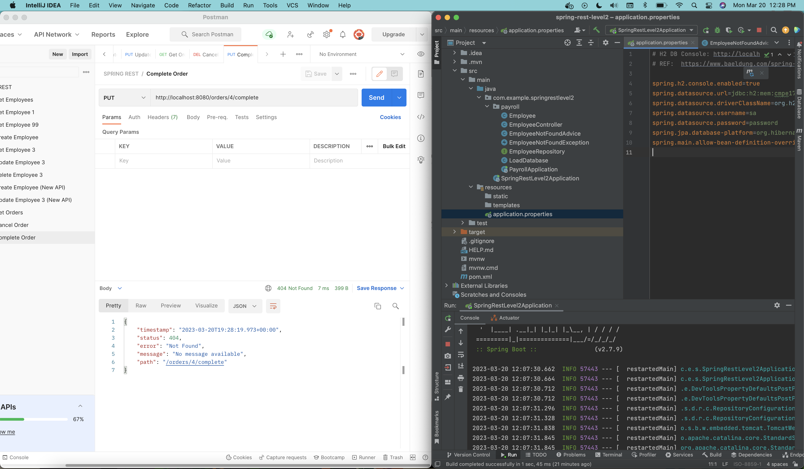

  

## spring-rest-level3 Screenshots
### Get Employees
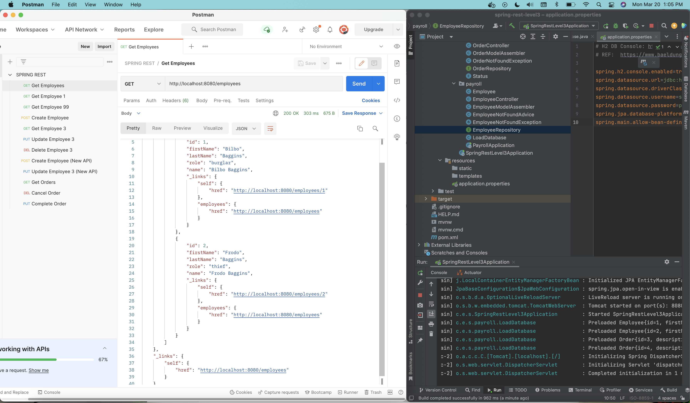
### Get Employee 1
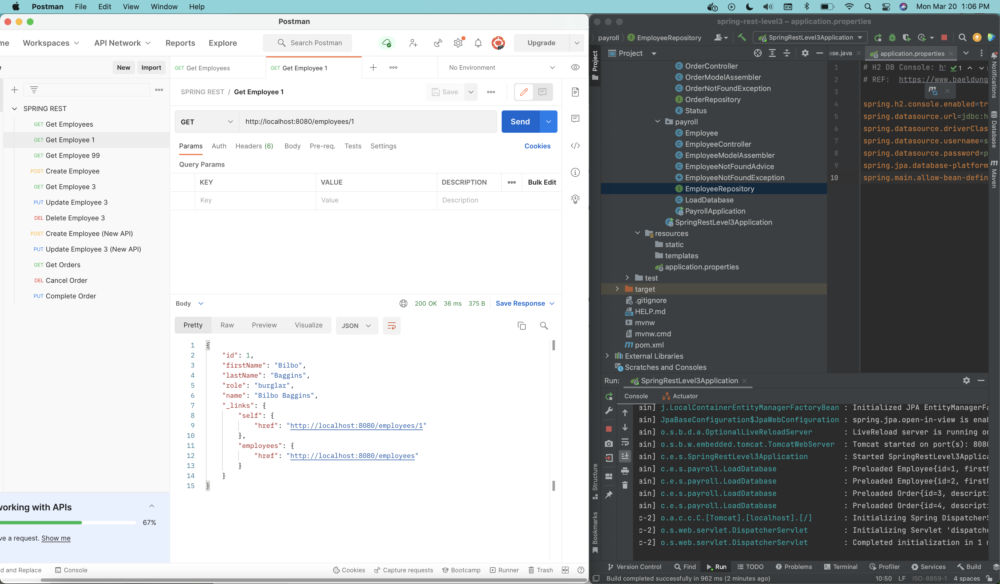
### Get Employee 99
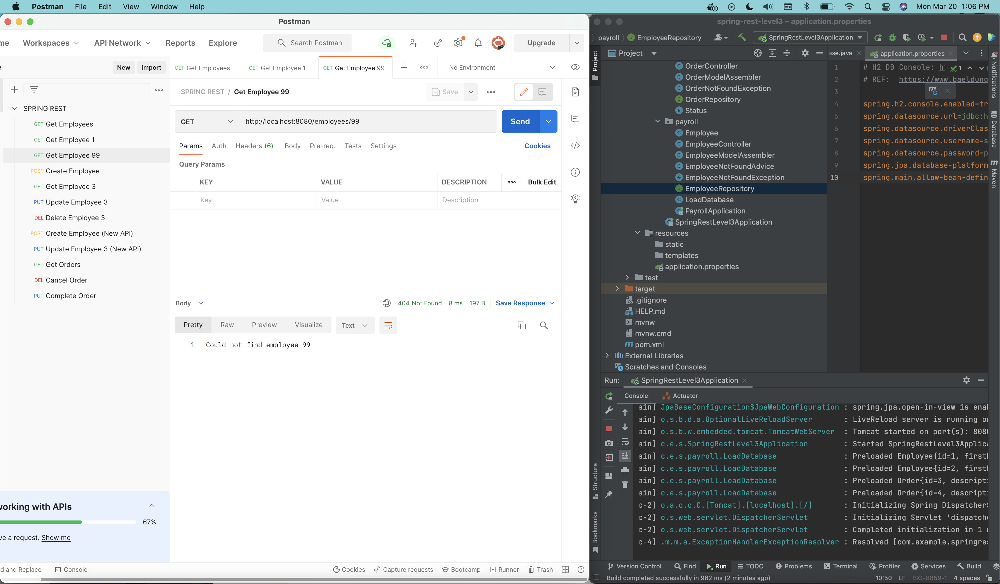
### Create Employee

### Get Employee 3
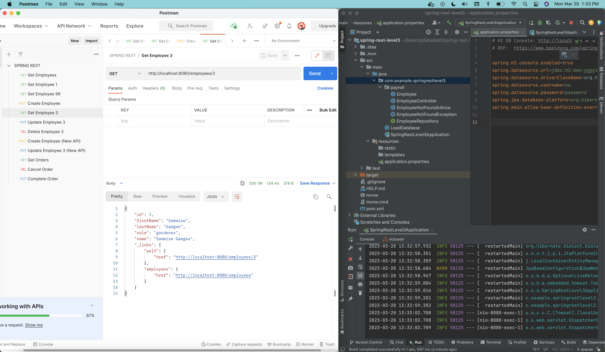
### Update Employee 3

### Delete Employee 3
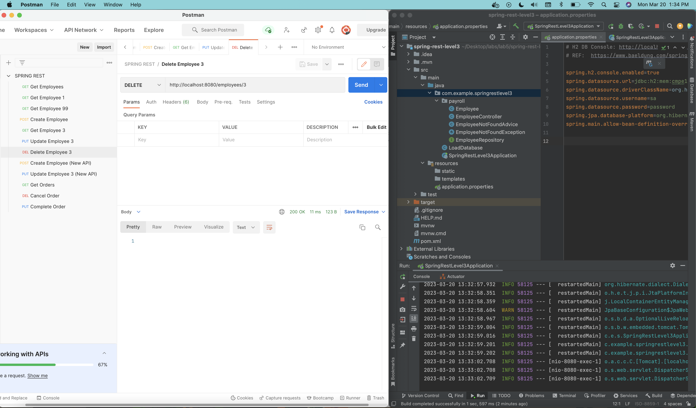
### Create Employee New API
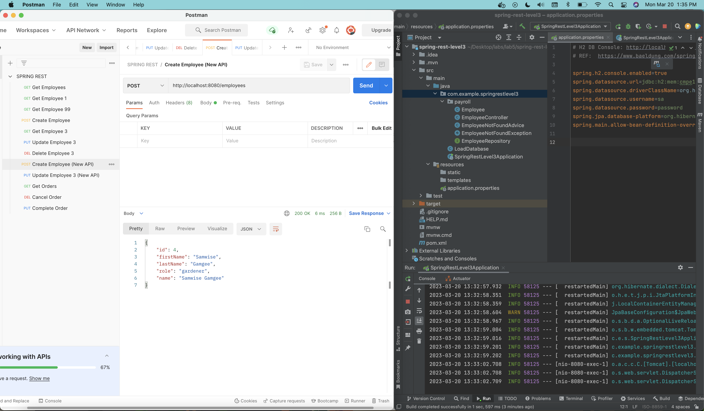
### Update Employee New API
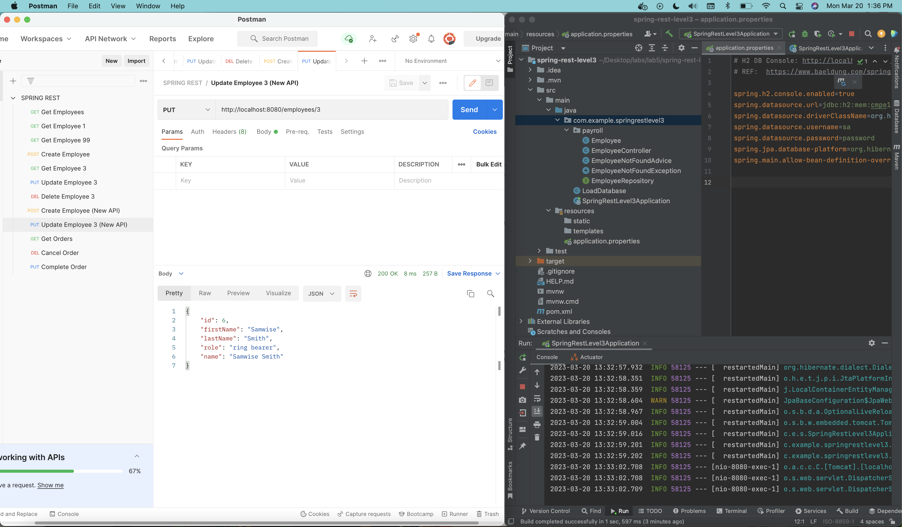
### We were told not to add the orders implementation, but here are the API calls via Postman, just in case:
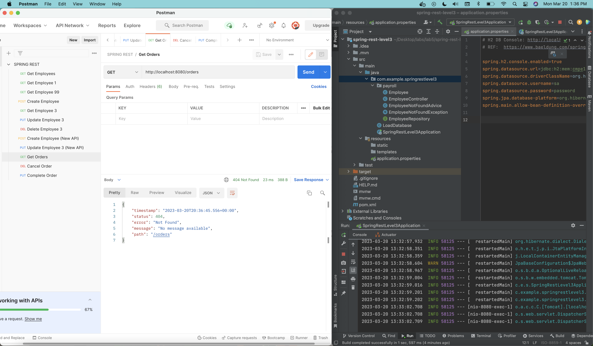
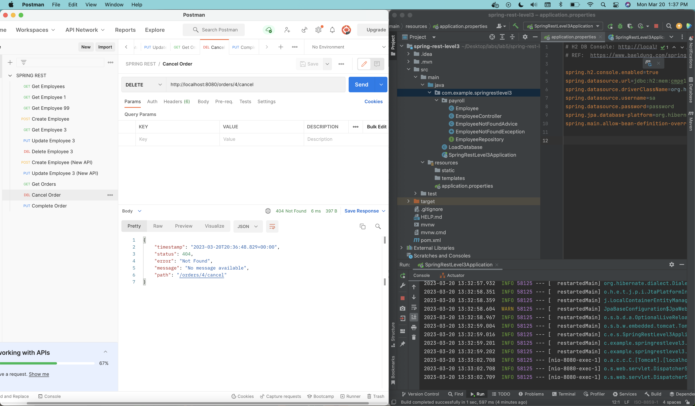
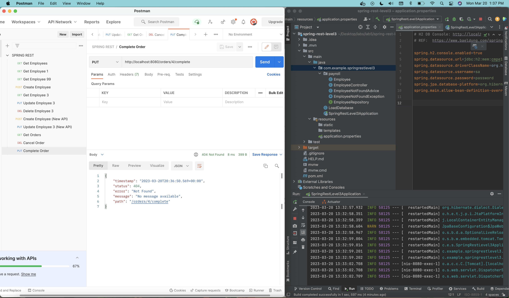
