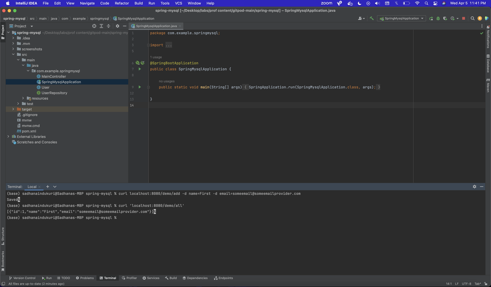
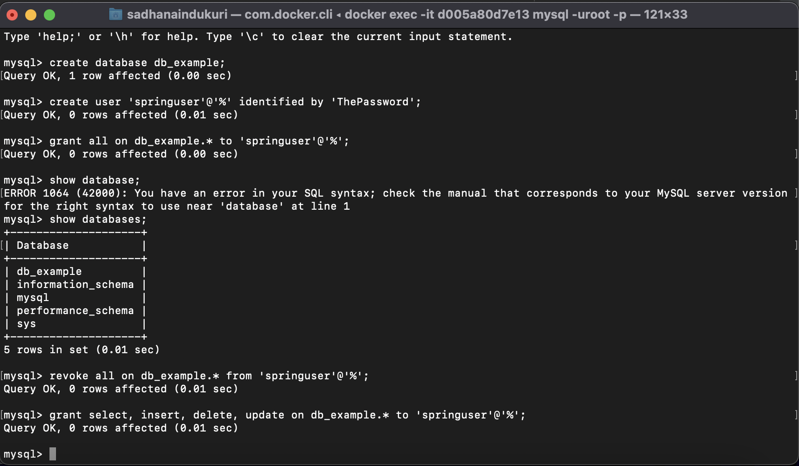
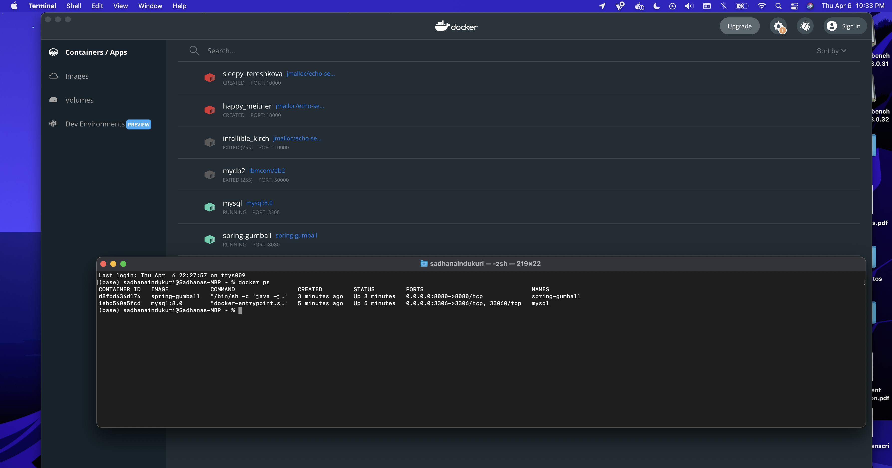
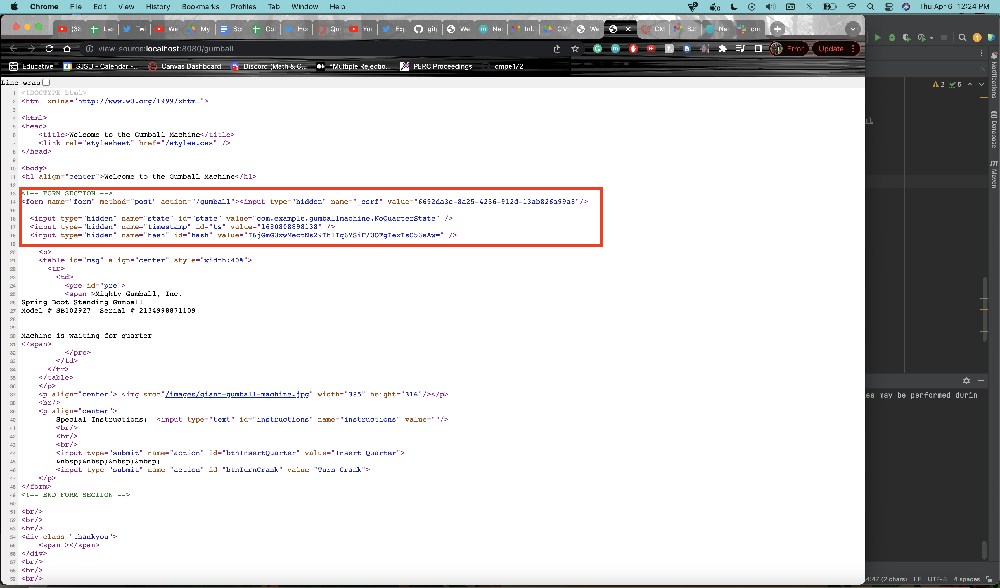
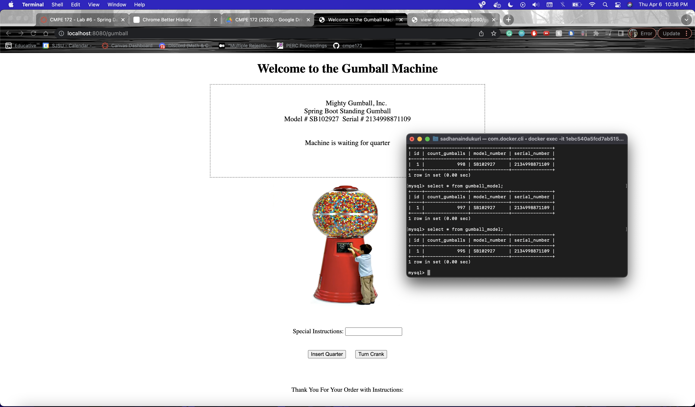

# CMPE 172 - Lab #6 Notes

## Screenshots (including console output) and Discussion confirming a working Spring JDBC and Spring MySQL projects
### Spring JDBC

By running our application, we are inserting four customers into our records. Then, we are querying records based on the first name Josh. The output is provided showing that our initial insertion process is working. Then, we shutdown out application. 
### Spring MySQL

I checked the application to see whether I was able to add a customer to my sql database. Then, I checked to see all of the users that were added to the database and it showed the user I just added, meaning my code works!
## Screenshots of deployment of Spring Gumball to Local Docker showing output of "docker ps" or running containers on Docker Desktop Dashboard.

## Screenshots of Spring Gumball (Version 3) running showing Web Page (with Hash) and HTML Source of the Page showing hidden fields.

## Discussion in Lab Notes on Spring JPA/DB changes in Spring Gumball (Version 3). Should include some evidence (i.e. Screenshots) of DB changes (i.e. inventory count updates) from Gumball Purchases.

My gumball application works since everytime we pressed enter quarter and turn crank, the inventory for gumball is decreasing. I also tested it multiple times, and the inventory changed by 2 instead of one meaning it is updating. 
