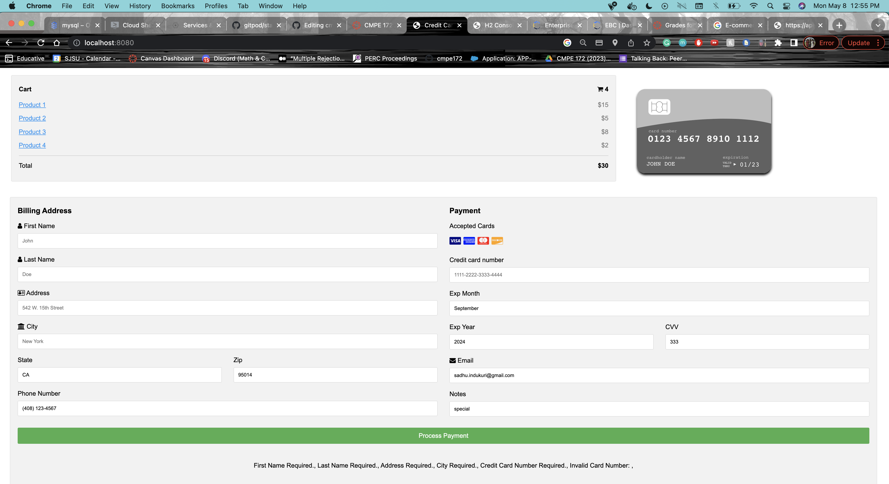
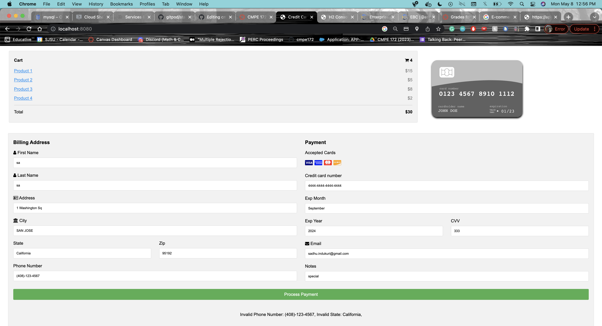
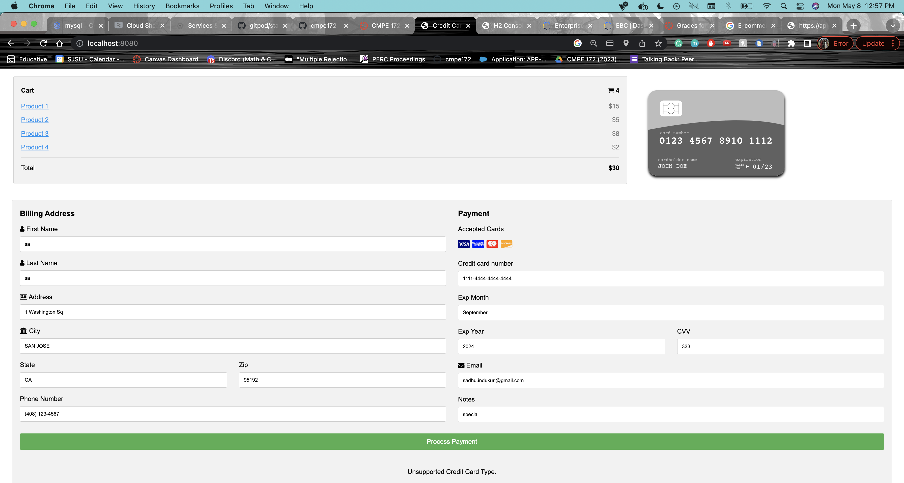
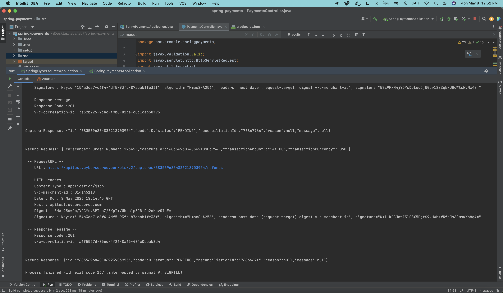
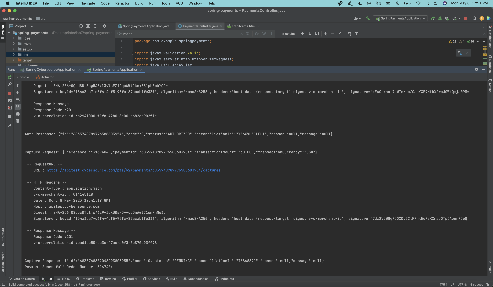
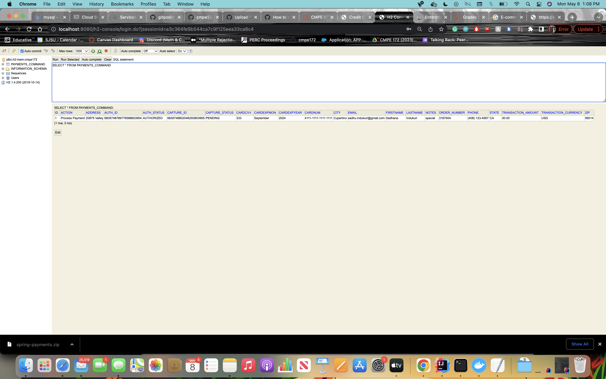

# CMPE 172 - Lab #7 Notes
## Sample Payment Screen Output

## API + Database
### running cybersource application

### output after performing successful payment in terminal for payment application

### payment was saved in the database

### Discussion of the Lombok, ThymeLeaf and Spring Features you used in this Lab.
 Lombok was used for the following: Creating constructors, getters, setters, equals() and more via the @Data annotation, @RequiredArgsConstructor  creates a constructor with fields. 
 Thymeleaf was used for the following: Thymeleaf was used for Mapping so that our application can access the correct methods while interfacing with the HTML templates, it allows us to inject values using ${...} into the HTML templates
 Spring Features: We used JPA in order to save information on the order placements via repositories and the H2 database. 
 
 ### Discuss why Jackson is needed and where it is used in the code for this Lab.
 Jacson is a library that helps to process JSON. We need Jackson in today's lab because we interact with the Cybersource API often during this lab. JSON is used in these interactions for the requests and responses for the Cybersource API. By using Jackson, we can properly handle the JSON data that we get through interacting with Cybersource. 

