# CMPE 172 - Lab #8 Notes
## Screenshots of your "full" desktop for each step (as shown above).
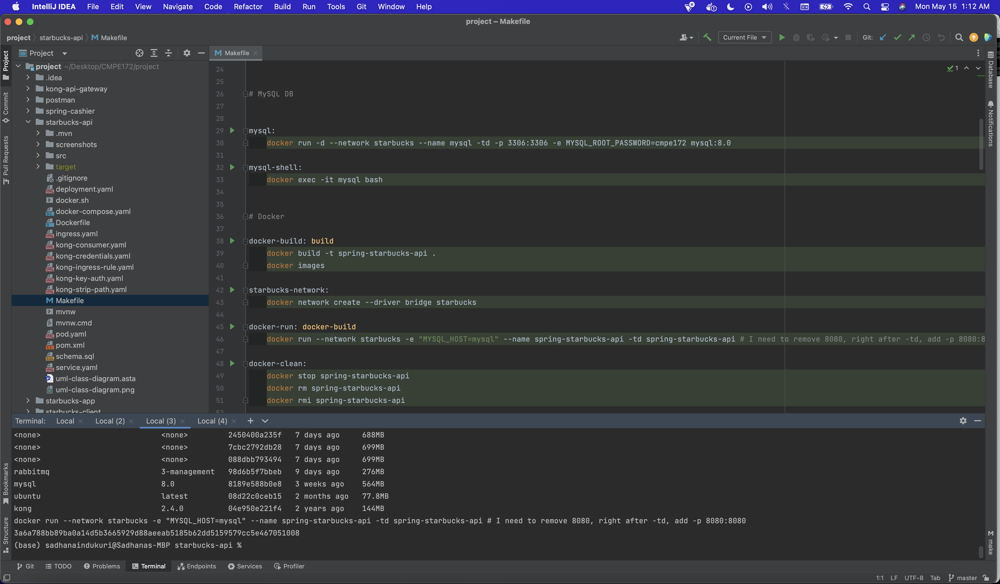
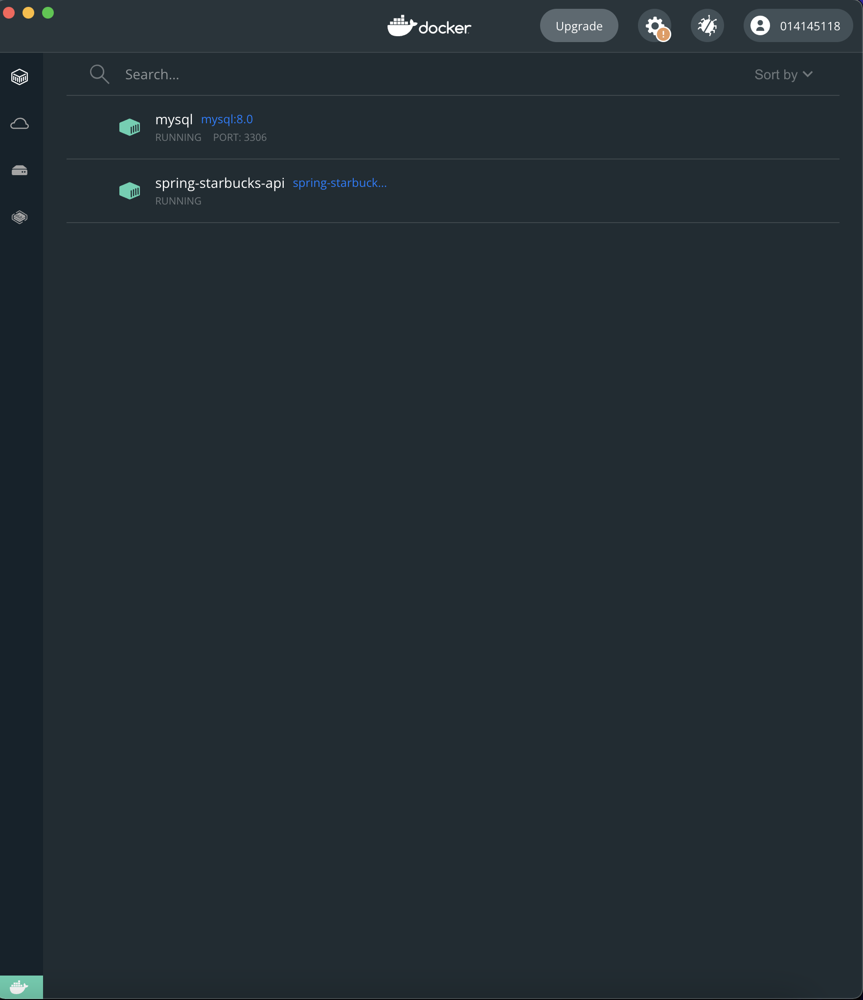
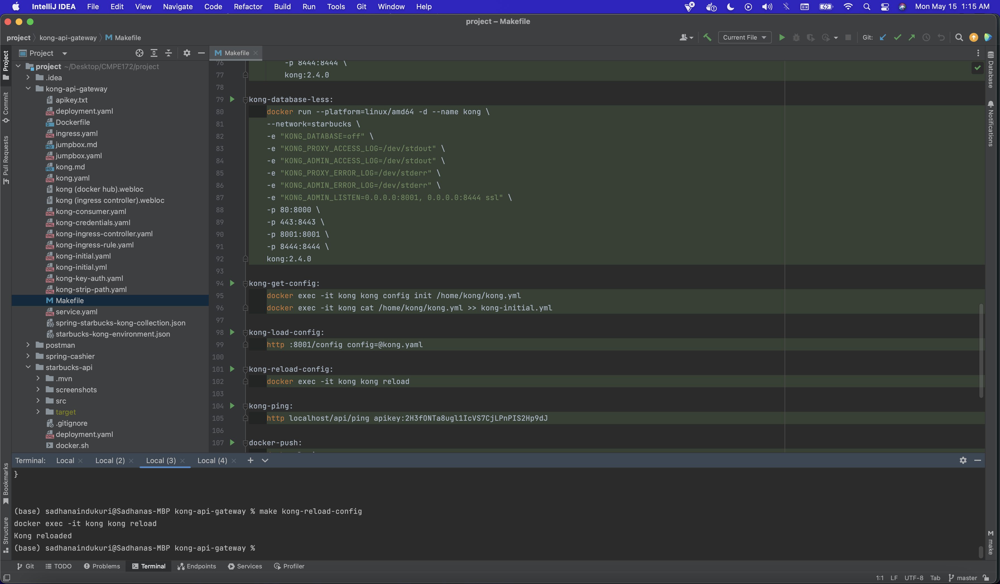
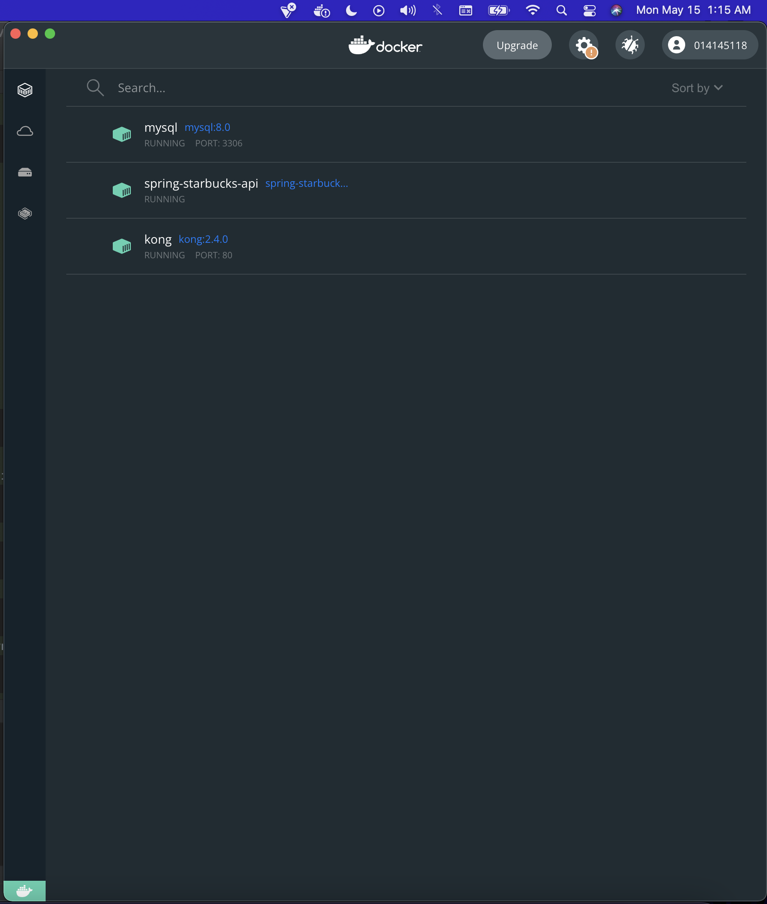
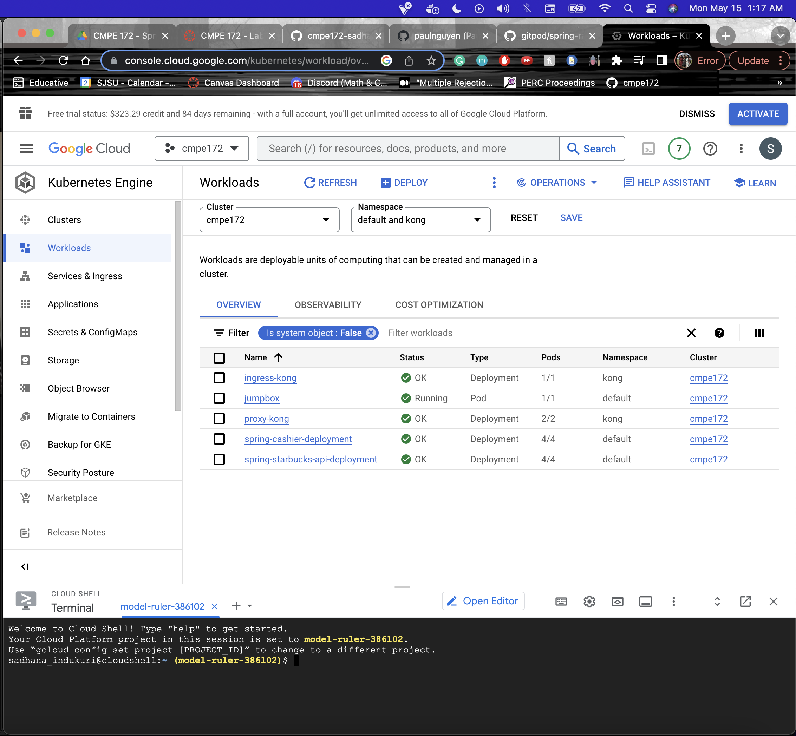

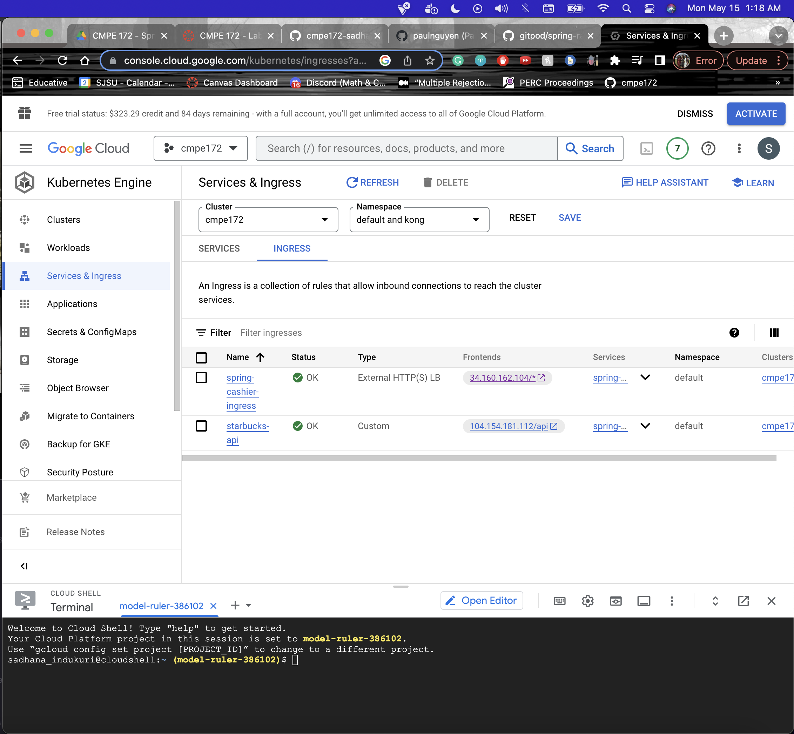
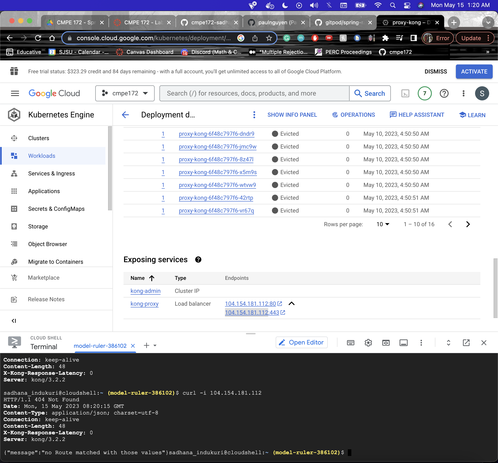
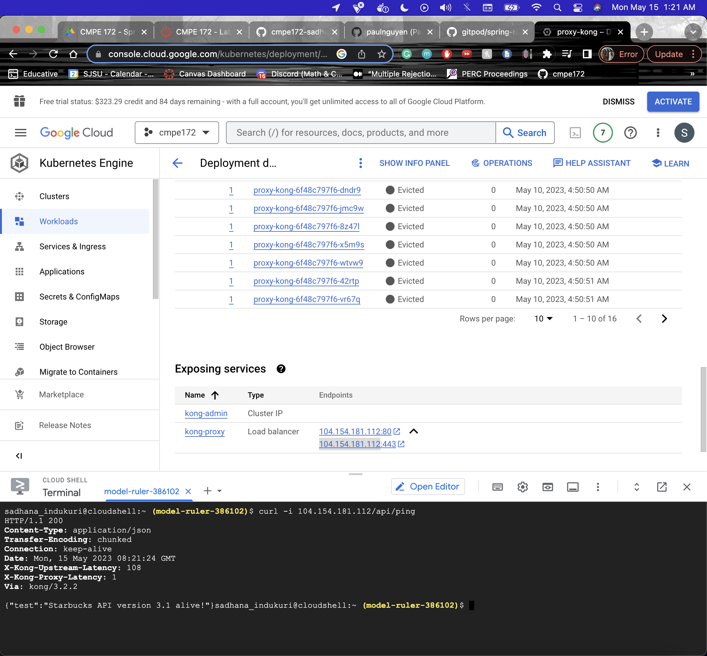
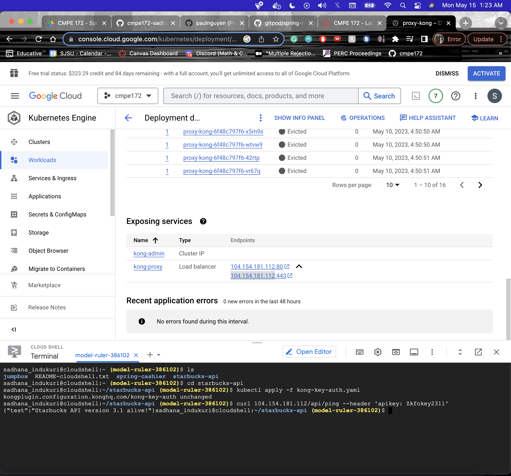
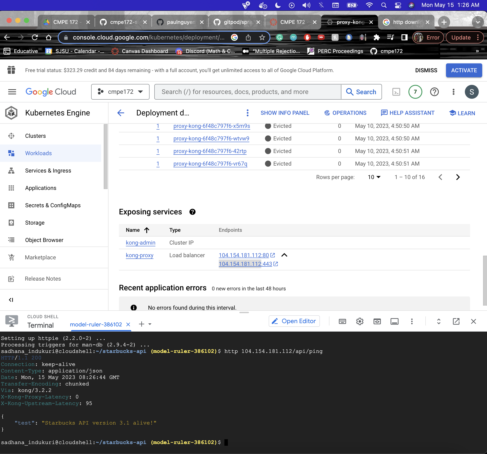
## Screenshots of your Postman API Tests with Request and Response and API key header
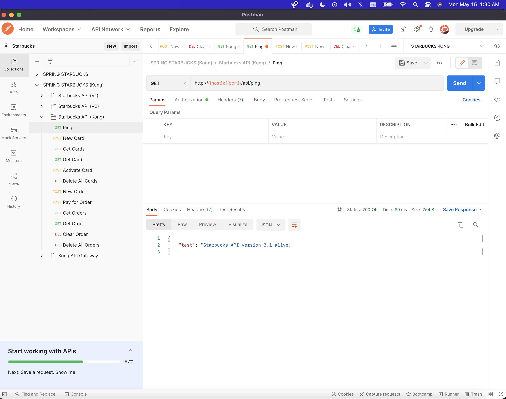
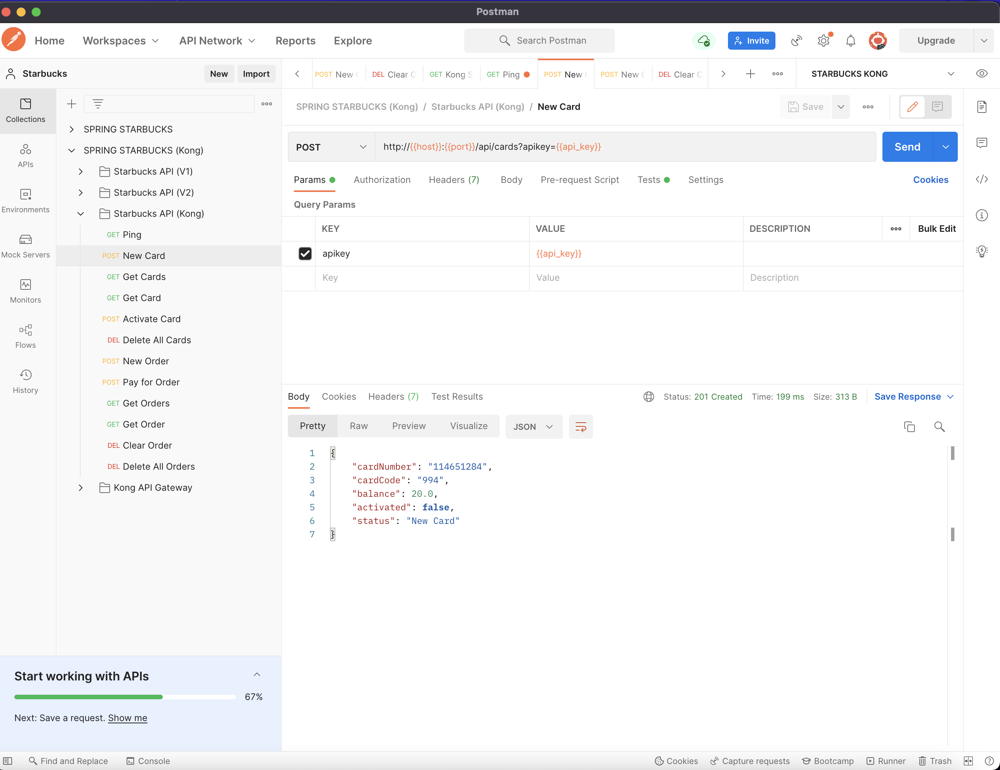
## Lab Notes
### Any challenges you face while working on this lab (i.e. GKE deployment issues) and how you overcame / solved them.
I had an issue with uploading to GKE with the following thing: 
apiVersion: extensions/v1beta1 in the file kong-ingress-rule.yaml. This caused an issue because this line of code was out of date. I needed to update it to the following: apiVersion: networking.k8s.io/v1. 
### A discussion of what changes would be needed in order to deploy your Starbucks API with MySQL / Cloud SQL.
I needed to update my deployment.yaml for the cloudSQL update. My starbucks api needed to connect to cloud sql by adding a SQL host and password. Then, I needed to build the cloud SQL in the gke workspace in order to have an online database. 
