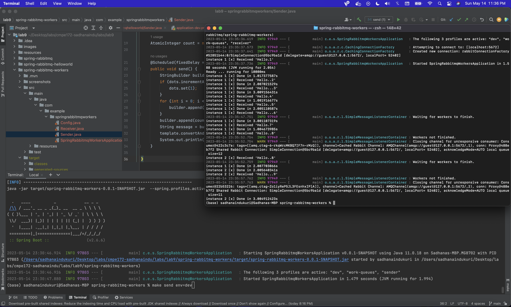

# CMPE 172 - Lab #9 Notes
## Messaging with RabbitMQ

## RabbitMQ Tutorial - Hello World

## RabbitMQ Tutorial - Work Queues

## A discussion of what Spring Profiles are and how they can be used in your Project
Spring profiles are a way to specify the types of configurations we want to use for certain situations. For this particular lab, we have three profiles, application.properties, application-dev.properties, and application-prod.properties. When we are calling the make commands, we need to provide the which profile. This allows us to use whatever we need, when we need it. 
## A discussion of how RabbitMQ can be used in your Project (i.e. what's the use case?)
There are many ways to use RabbitMq in a spring-boot application. We can use RabbitMq to communicate between the multiple microservices that we need to deploy for the starbucks project!
