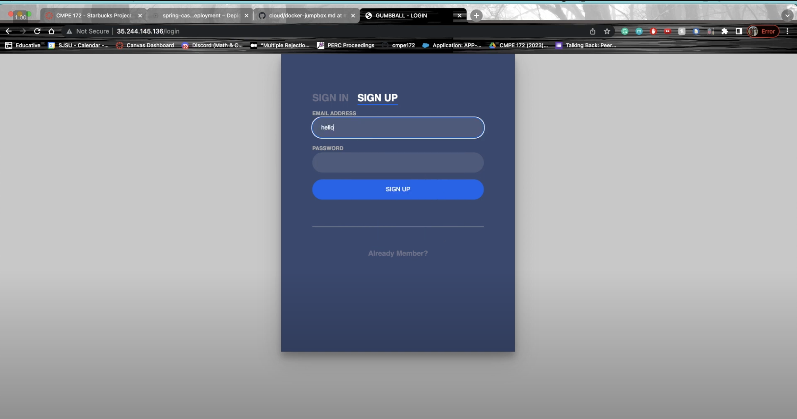
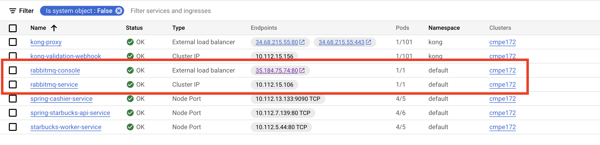

# CMPE 172 Starbucks Project Journal

## Overall Architecture Diagram

## Feature Deep Dive

### Cashier App
The cashier app was created via spring-boot and utilizes an API to allow a cashier to place an order, get an order and clear an order. The app allows the cashier to specialize in the type of order they want to create by allowing the cashier to use a drop-down menu to change the size, milk, and drink type. The app also allows a cashier to choose the location of their store. Then, once the order is placed, the price of the drink is calculated and saved in the database through interfacing with the API. If the cashier wants to change registers and come back to the register where they placed an order, they can change the register location, press the get order button, and get the order that hasn't been cleared yet and visualize the details of the order. Then, if they are done processing the order, they can clear the order. All of the backend processing and saving of this information is done in the Starbucks rest API.

We don't want just anyone to access our application. Therefore, I have added login and registration for the cashier app. Anytime a user tries to access the cashier application, they need to create an account and log in or use pre-existing credentials to log into the application. The login information is saved into the database, meaning that the user information is not in memory or hard-coded into the application code. Once a user is logged into the application, they can log out via a button on the far left. 

Because there is a load balancer for the cashier app, we need a way to preserve the session of the user so that they don't get logged out constantly. The way I handled this is through JDBC sessions. The session information is saved in the cloudSQL database so that users can have a smooth viewing process.  

### Starbucks Rest API
The Starbucks REST API is a way to break up our project into microservices. The REST API handles all of the database interfacings. Every other service, like the cashier app and starbucks-worker, needs to interact with the API to save, delete, and get information from the database. This is done via creating models that simulate the objects we want to store in the database, creating repositories to hold instances of the models, creating controllers that allow us to map certain requests to actions, and building a service that fulfills the actions mapped out by the controller. I have the following actions that can be performed by my API:

* Get a list of all orders
* Delete all orders
* Create a new order
* Get the details of an active order
* Clear an active order
* Edit an order's status to FULFILLED (for RabbitMQ)
* Process the payment for an active order

To interact with the API, I deployed Kong. Kong is an API gateway that I use to funnel all API requests through. The purpose of Kong in my application is for load balancing and security. Through Kong, I was able to deploy a load balancer for my API, thus increasing its ability to scale. Further, I also added security to getting access to my API via an API key. 

### Cloud Deployments
I have made the following cloud deployments
**Deployments**
* Starbucks Worker Deployment
* Jumpbox
* Spring Cashier Deployment
* Spring Starbucks API Deployment
* Starbucks Worker Deployment
* RabbitMQ
* Ingress-Kong (This may not need to exist, I will explain more in my design notes)

Further, in order to have these deployments be able to interact with each other, I needed to deploy the following services:
* Kong Proxy
* Kong Validation Webhook
* RabbitMQ Console
* RabbitMQ Service
* Spring Starbucks API service
* Starbucks Worker Service
* Spring Cashier Service

Finally, I also deployed two Ingresses, one more than needed:
* Spring Cashier Ingress
* Starbucks APi (Ingress for Kong)

#### Design Notes on GitHub an Architecture Diagram of the overall Deployment.
Overall, the design for my project makes sense. Each service is grouped together based on the type of service they provide and how they are meant to interact with other services. Further, every service builds on top of another. I first created the SQL database, since that is the foundational building block of my application. Then, I started with deploying the Starbucks API, then the gateway to the API via Kong, then I deployed the user interface that depends on the API and Kong, Spring-Cashier. Later, I added more functionalities like RabbitMQ. All of these deployments came with services since they need to be able to interact with each other. And anytime there is a service that needs to be interacted with from the outside, I created an Ingress for it. 

There is one sector of my architecture diagram and deployment that I think is **unnecessary**. One of the requirements for this project was the following:

* External Load Balancer as Ingress for Cashier's App (10 points)
* Internal Load Balancer for Starbucks API behind Kong API Gateway (15 points)

I created an Ingress for the cashier app, which allows me to interact with the application from the outside and also provides a load-balancing service. For the second internal load balancer, I deployed a service called Kong-proxy that acts as a load balancer, therefore the second requirement is also met. However, I also added an extra component, an ingress for Kong. This will provide an external load balancer for Kong as well, which is unnecessary. This is why it is not reflected in my architecture diagram as it does not add anything substantive to the architecture of the diagram than redundancy. Due to the time constraint, I don't have the time to redo my demo and retake all of my pictures. However, I do recognize this oversight. 

#### How does your Solution Scale?  Can it handle > 1 Million Mobile Devices? Explain.
I do believe, theoretically, my solution would scale. However, not in its current form. Through the use of Kong as an internal load balancer, Ingress as an external load balancer, all of the security features we built, and the asynchronous processing of orders, many people should be able to log in and try to use our application. But, there are two issues I see that might hinder the use of my application at scale:
* If there are multiple cashiers at the same store trying to place and process an order, the active order component of our code is not specific to the cashier themselves, but the store they operate in. Meaning, that only one cashier can have an active order at a time in a store. 
* When we configured our cluster, project, and database, we used settings that utilized the least memory and space. However, if we want to handle the data of a million mobile devices, we would need to expand our current environment. 

## Technical Requirements

I will do a deep dive on the requirements using the scoring rubric:

### Cashier's App

#### Port Node.js App to Spring MVC (required)

I ported the Node.js application to Spring MVC. In my project code, there are two folders. The original and the Spring MVC version, as shown below:

#### Web rendering must be done in View Templates

Under my resources folder in my spring-cashier application, I have a templates folder that has HTML files for login, registration, the register interface, and more. 

#### Controller must process JSON responses from API and pass to View via Models

The cashier controller accesses the API via the Kong Endpoint, utilizes the GetMapping to get JSON responses and saves that information into a command object. This command object is utilized in the HTML page to populate the HTML page with information from the API. 

#### Output and "Look and Feel" of Web UI must match that of Node.js App

I tried my best to emulate the look of the Web UI, it doesn't look exact.

#### Support Admin Logins for Starbucks Employees: Must not store credentials in memory or hard code in source code, Should also include New Account Registration and Logout

I added login, registration, and logout facilities to my application. I save login and registration information in the database, so they are not hardcoded into my code. 

#### Support In Store Order Processing 
This is shown in the demo video below!

### Scalable Cloud Deployment on GCP

#### External Load Balancer as Ingress for Cashier's App

I deployed an external load balancer through Ingress for the cashier app. There are four network endpoints for my deployment and all are healthy. I had to change the address of the health check in order to bypass the spring-security that causes the health check to fail. Ingress not only provides load balancing services, but it also allows connections from outside of the GKE cluster, which is necessary for 

#### Internal Load Balancer via Kong Proxy

I deployed Kong Proxy as service that provides an internal load balancer for the starbucks API behind the Kong Gateway. There are two endpoints, as shown in the image below. 

### Implementation Uses Required Cloud Databases

#### Must use Cloud SQL

I use Cloud SQL in order to save all of my order, user, and session information.

#### Update Starbucks API to use JPA with MySQL

Starbucks API has been updated to use JPA with MySQL. For example, the starbucks order and starbucks card repositories are used to save starbucks orders and cards. These repositories extend JpaRepository.

#### Must use GKE RabbitMQ Operator

I deployed rabbitMQ in GKE. Here are the deployments and services needed to run RabbitMQ in GKE for my application. 

Starbucks Worker is a component needed to fulfill orders asynchronously. It goes through the queue, that is populated by the API, and changes the status of the orders from paid to fulfilled. This component does not have access to mySQL directly, I make it go through the kong gateway and API. 

#### Extend the Starbucks API to support async order processing (to use RabbitMQ)

I had to extend the abilities of my API to be able to edit an order's status to FULFILLED for RabbitMQ to be able to process async order processing. I created a new API endpoint in my order controller and also added a new method in my StarbucksService class to edit the status of an order within the database. I also added code to add an order to the queue within my StarbucksService class so that it adds it to the queue for the Starbucks Worker to asynchronously fulfill orders. 

### Starbucks API for Mobile App and Store Front
#### Deployed with Kong API Gateway with API Key Authentication

I deployed Kong API Gateway with the following API Key: Zkfokey2311. 

#### Async Request API to "Make the Drink" once Order has been Paid (i.e. put request into a Queue)

The following code in API puts the order in the queue for the starbucks worker to "make the drink"

#### Async Check Order Status API to "Check Status of Drink" in the Starbucks Database

I don't think I was able to implement this portion of rabbitMQ. 

#### Will need a Background Worker Job (i.e. Spring Scheduler) to pick up Orders and Make Drinks

As seen in my GKE deployments, I build a starbucks worker that picks up orders and makes drinks. 

## Status Reports for Commits 
#### (I only commited on 8 seperate days, but there will be 9 Journals as I made substantive changes in one day that I feel needed to be documented.)

### Journal One
Commit Link: https://github.com/nguyensjsu/cmpe172-sadhanaindu/commit/651fc95631a407c7c9a6fe1bb6b9583a7478f9d1

#### Acomplishments:
This commit has the details of all of my docker demo implementations. I accomplished the following in this commit:
- Ported Node JS to Spring MVC
- Built an API so that no other container directly interacts with the SQL database
- Create Kong and push all API interactions through the Kong Endpoint
- Build SQL database
- Allowed for interactions between the Mobile App and Cashier App

#### A discussion of the challenges you faced that week and how your resolved those issues.
The challenges I faced were related to Kong and the API. Since most of the porting from NodeJS to Spring MVC was done within the midterm, adding Kong and an API were challenging. I  had to extend some of the abilities of the starter code for the API, like getting details of the order or clear order, that I needed to fully implement. Further, I needed to keep track of what order was active and what was not, this required me to come up with my own solution, which took a bit of time. I also struggled with Kong and how to utilize it within my controller for the cashier app. I was unfamiliar with Rest Templates and how to interact with API endpoints from another service. I resolved this by looking at the starter code and trying to guess what would naturally need to happen to do what I wanted to do. 

### Journal Two
Commit Link: https://github.com/nguyensjsu/cmpe172-sadhanaindu/pull/1/commits/5600328198d6e0af104a1e4b9bccbb7b1b0880f8

#### Acomplishments:
I accomplished the following in this commit:
- Added Login and Registration
- Deployed the API, Kong, and the Cashier to GKE

#### A discussion of the challenges you faced that week and how your resolved those issues.
The challenges I faced were related to login and registration. I also struggled with deploying to Kubernetes. One was resolved, but the other was not. I had an issue with registration and login where I kept being logged out of my cashier app because there was nothing to save sessions. I didn't understand that I could use JDBC to save this information because I thought we could only interact with the database via the API. I also struggled with deploying to Kubernetes, which was resolved. Because my health check for the cashier ingress was pointing to "/", my backend services kept saying that they were failing. After talking to the professor and looking at past demos, I learned that I had to change the health check link from "/" to "/login" because "/" is protected by spring sessions. 

### Journal Three
Commit Link: https://github.com/nguyensjsu/cmpe172-sadhanaindu/commit/4f5e5ced892c35b878357b6006f4a8c796cab5c9

#### Acomplishments:
I accomplished the following in this commit:
- Added spring sessions
- Removed Redis from code

#### A discussion of the challenges you faced that week and how your resolved those issues.
In order to enable JDBC sessions for the cashier app, I initially tried to do it via the API. I really struggled with this because I did not know how to pass all of that information to the API to handle. So, after looking through some of the Slack messages, I realized that I could just interact with the SQL database from the cashier app directly. This made the process much quicker. Also, because I reused my code from the midterms, I realized that my code relied on Redis. I made sure to remove Redis from my application as it is no longer being used for session storage. 

### Journal Four
Commit Link: https://github.com/nguyensjsu/cmpe172-sadhanaindu/commit/b7d8102a2b64e2c845b246db2d7d9c68e372d6c6

#### Accomplishments:
I accomplished the following in this commit:
- Made the API Stateless

#### A discussion of the challenges you faced that week and how your resolved those issues.
This was the first time I needed to redeploy in GKE and I kept running into the issue of the image pushed to docker not being used when redeploying. I was struggling with how to figure this out, so I searched for why this was happening. I learned from this search that I needed to make edits to my deployment.yaml to include "imagePullPolicy: Always". This will force Kubernetes to always pull from the docker hub instead of using the one that is cached. I also struggled with how to make the API stateless. Following the hint from the professor on Slack, I realized that I needed to update my code so it doesn't rely on the Hashmap but I was unsure as to how. I solved this by taking a step back, assessing what the hashmap was doing, and realizing I could just interact with the database to store information instead of keeping it in the code via a hashmap.

### Journal Five
Commit Link: https://github.com/nguyensjsu/cmpe172-sadhanaindu/pull/4/commits/8561a5621d0dc8140dd7e160b763b5524d1df8ad

#### Acomplishments:
I accomplished the following in this commit:
- Starbucks Worker

#### A discussion of the challenges you faced that week and how your resolved those issues.
At this point in time, I knew that I needed to add rabbitmq but didn't really understand what it was. I had an office hours appointment with the professor in a few days, but I still wanted to make progress. So, I looked at the Spring-Gumball-V3.5 to see what the professor was doing. I saw that he created a gumball-worker to handle orders, so I tried my best to emulate it. I didn't fully understand how this worker handles everything asynchronously, but I tried my best. I updated all of the code so that the starbucks-order will be updated to "FULFILLED" when there is an order in the queue that has been cleared. 

### Journal Six
Commit Link: https://github.com/nguyensjsu/cmpe172-sadhanaindu/pull/5/commits/a1a0937983b11601baf75b3859ef7334d9bed8e5

####  Acomplishments:
I accomplished the following in this commit:
- Deployed RabbitMQ to GKE

#### A discussion of the challenges you faced that week and how your resolved those issues.
After attending office hours with the professor and asking him questions about RabbitMQ, I understood what the purpose of RabbitMQ was and how to use it. So, instead of trying to deploy Starbucks-Worker first, even though I worked on it first, I realized I needed to deploy RabbitMQ and start to update my API. I followed lab 9 and utilized the yaml files to deploy the correct deployments and services for RabbitMQ. 

### Journal Seven
Commit Link: https://github.com/nguyensjsu/cmpe172-sadhanaindu/pull/6/commits

#### Accomplishments:
- Fixing Credentials
- Debugging Deployments

#### A discussion of the challenges you faced that week and how your resolved those issues.
This was the toughest day of my entire project. I was working on deploying RabbitMQ and my computer started freaking out. I kept getting minimum availability errors because of memory issues with my computer. This caused me to have to delete and restart my deployments, which would then fail because there wasn't enough memory. After 5 hours, I had no components in my GKE and I deleted my project to start again. If that didn't work, I wouldn't have anything to demo. I utilized a desktop and rebuilt my project from the ground up in GKE, with the SQL database included. It was nerve-wracking, but I used the opportunity to fix some of the issues I created in my initial deployments. I fixed some of the credentials in my code so that no sensitive information was hard-coded into my application. I utilized environment variables for this. Further, there was an issue with the bit.ly link used to deploy Kong in GKE that another student kindly found! This helped me get close to finishing the project.

### Journal Eight
Commit Link: https://github.com/nguyensjsu/cmpe172-sadhanaindu/pull/7/commits/16673c69c6853300833b3c8a97157a9c832dbe66
Commit Link: https://github.com/nguyensjsu/cmpe172-sadhanaindu/commit/5ef81d05a63512ef7d7c0a26f71f5b3068f7c75a

#### Accomplishments:
- RabbitMQ and Starbucks-Worker working
- Logout Button

#### A discussion of the challenges you faced that week and how your resolved those issues.
From my understanding that the API is supposed to input orders into the queue for the other service, starbucks-worker, to fulfill, I got to work on both of these components. In the API, I had to create a new API endpoint for the starbucks worker to be able to update the status of an order. I also added code that allowed the API to add orders to the queue. I struggled with identifying where to place this line of code, but I settled on the place order, as that is the inception of the order. Next, I updated the starbucks-worker so that it interacts with the starbucks-api to update the status of an order. I also updated the credentials of the RabbitMQ so that it utilizes environment variables for the purposes of injection. Next, while making the demo video, I realized there was no logout button in my application. I struggled with whether I should add the logout button as I thought it would be time-consuming, but I decided to give it a try and was able to get it done quickly!

## Demo Link:
https://youtu.be/_ft2T495lHo

